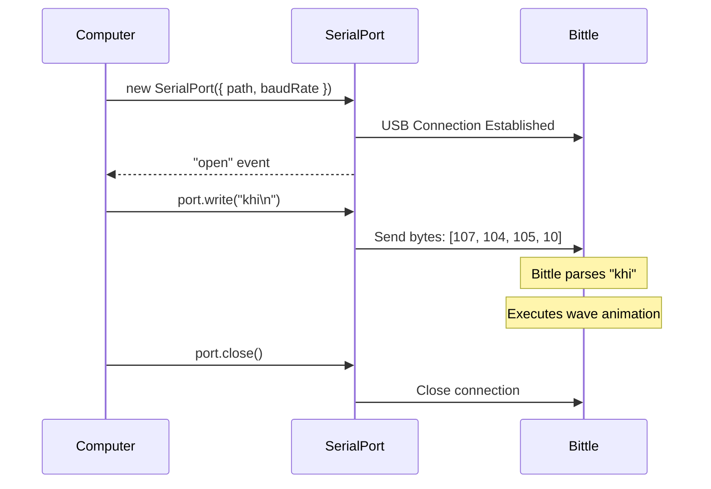
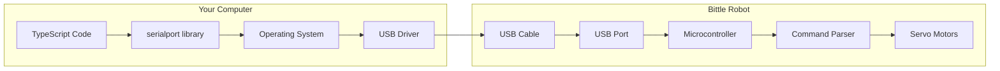

# Module R1: Hello Bittle — Serial Basics

Control a [Petoi Bittle X](https://www.petoi.com/pages/bittle-open-source-bionic-robot-dog) robot dog with just 20 lines of code.

**Goal**: Understand the fundamentals of serial communication with a robot.

**Time**: 1-2 hours

**Prerequisites**: Node.js 18+, a Petoi Bittle X robot, USB cable

---

## What You will Learn

1. What is serial communication
2. How to find your robot's serial port
3. How baud rates work
4. The Bittle command protocol
5. Sending commands from TypeScript

---

## Quick Start

```bash
# Find your Bittle's serial port
python3 detect-device.py

# Install dependencies
cd hello-bittle
pnpm install

# Run the hello example (replace with your port)
SERIAL_PORT=/dev/cu.usbmodemXXXX pnpm start
```

---

## Understanding Serial Communication

### What is Serial?

Serial communication is the simplest way for a computer to talk to hardware. Data is sent one bit at a time over a wire - like sending letters one by one through a tube.

```
┌──────────────┐      USB Cable      ┌──────────────┐
│   Computer   │ ──────────────────> │    Bittle    │
│(sends "ksit")│                     │  (sits down) │
└──────────────┘                     └──────────────┘
```

When you connect Bittle via USB, it appears as a **serial port** on your computer:

- **macOS**: `/dev/cu.usbmodem*` or `/dev/cu.usbserial*`
- **Linux**: `/dev/ttyACM0` or `/dev/ttyUSB0`
- **Windows**: `COM3`, `COM4`, etc.

### What is a Baud Rate?

The **baud rate** is the speed of communication - how many bits per second are sent.

Think of it like two people agreeing to speak at the same pace. If one speaks too fast or too slow, the other cannot understand.

**Bittle uses 115200 baud** (115,200 bits per second).

Both sides must use the same baud rate:

```typescript
const port = new SerialPort({
  path: "/dev/ttyACM0",
  baudRate: 115200, // Must match Bittle's setting
});
```

Common baud rates:
| Rate | Use Case |
|--------|-----------------------------|
| 9600 | Slow, legacy devices |
| 115200 | Bittle, most modern devices |
| 921600 | High-speed applications |

---

## The Bittle Command Protocol

Bittle understands simple text commands sent over serial. Each command:

1. Starts with a **prefix letter** (usually `k` for "skill")
2. Followed by an **action name**
3. Ends with a **newline** (`\n`)

### Command Format

```
k + action + \n
```

Examples:

- `ksit\n` - Sit down
- `kbalance\n` - Stand balanced on all fours
- `khi\n` - Wave hello
- `kwkF\n` - Walk forward

### Common Commands Reference

| Command       | Code       | Description        | Duration |
| ------------- | ---------- | ------------------ | -------- |
| Sit           | `ksit`     | Sit down           | 2s       |
| Balance       | `kbalance` | Stand on all fours | 2s       |
| Stand Up      | `kup`      | Stand up tall      | 2s       |
| Rest          | `krest`    | Lie down           | 3s       |
| Hi            | `khi`      | Wave hello         | 3s       |
| Walk Forward  | `kwkF`     | Walk forward       | 4s       |
| Walk Backward | `kbk`      | Walk backward      | 4s       |
| Trot Forward  | `ktrF`     | Fast walk forward  | 3s       |
| Jump          | `kjmp`     | Jump               | 2s       |
| Push Up       | `kpu`      | Do a push up       | 5s       |
| Play Dead     | `kpd`      | Play dead          | 3s       |
| Stretch       | `kstr`     | Stretch            | 3s       |

Full command list: [Petoi Serial Protocol Docs](https://docs.petoi.com/apis/serial-protocol)

---

## Finding Your Serial Port

### Method 1: Device Detector Script

Run the included Python script:

```bash
python3 detect-device.py
```

Then connect your Bittle via USB. The script will show the new port:

```
[NEW] Device connected:
  --> /dev/cu.usbmodem14101

  Use this port: SERIAL_PORT=/dev/cu.usbmodem14101 pnpm start
```

### Method 2: Manual Check

**macOS:**

```bash
ls /dev/cu.usb*
```

**Linux:**

```bash
ls /dev/ttyACM* /dev/ttyUSB*
```

**Windows:**
Open Device Manager → Ports (COM & LPT)

---

## Code Walkthrough

### Minimal Example (`hello-bittle/src/index.ts`)

```typescript
import { SerialPort } from "serialport";

// 1. Configuration
const SERIAL_PORT = "/dev/ttyACM0";
const BAUD_RATE = 115200;

// 2. Open connection
const port = new SerialPort({
  path: SERIAL_PORT,
  baudRate: BAUD_RATE,
});

// 3. Wait for connection
port.on("open", () => {
  console.log("Connected!");

  // 4. Send command
  port.write("khi\n"); // Wave hello

  // 5. Wait and close
  setTimeout(() => port.close(), 3000);
});
```

That is it! Five steps to control a robot.

---

## How It Works



### Byte-Level Details

When you send `"khi\n"`, the computer actually sends these bytes:

| Character | ASCII Code | Binary   |
| --------- | ---------- | -------- |
| k         | 107        | 01101011 |
| h         | 104        | 01101000 |
| i         | 105        | 01101001 |
| \n        | 10         | 00001010 |

At 115200 baud, this takes about 0.3 milliseconds to transmit.

---

## Architecture Overview



---

## Troubleshooting

### "Permission denied" Error

**Linux**: Add your user to the dialout group:

```bash
sudo usermod -a -G dialout $USER
# Log out and back in
```

**macOS**: Usually works without extra permissions.

### "Port not found" Error

1. Check USB cable is connected
2. Run `python3 detect-device.py` to find the correct port
3. Make sure no other program is using the port

### "Bittle does not respond"

1. Make sure Bittle is powered on
2. Check baud rate is 115200
3. Make sure command ends with `\n`
4. Wait for Bittle to boot (5-10 seconds after power on)

### Commands run too fast

Bittle needs time to complete each action. Add delays between commands:

```typescript
port.write("ksit\n");
await wait(2000); // Wait 2 seconds
port.write("khi\n");
await wait(3000); // Wait 3 seconds
```

---

## Exercises

### Exercise 1: Create Your Own Sequence

Modify `hello-bittle/src/demo.ts` to create a custom dance routine:

```typescript
await sendCommand(port, "sit", 2000);
await sendCommand(port, "pushUp", 5000);
await sendCommand(port, "jump", 2000);
// Add more commands!
```

### Exercise 2: Interactive Control

Create a script that reads keyboard input and sends commands:

```typescript
import readline from "readline";

const rl = readline.createInterface({
  input: process.stdin,
  output: process.stdout,
});

rl.on("line", (input) => {
  const command = COMMANDS[input];
  if (command) {
    port.write(command + "\n");
  }
});
```

### Exercise 3: Read Serial Response

Bittle sends data back! See the complete example in `src/exercise3.ts`:

```bash
SERIAL_PORT=/dev/cu.usbmodem* pnpm exercise3
```

This demonstrates reading serial responses by listening to data events:

```typescript
port.on("data", (data) => {
  console.log("Bittle says:", data.toString());
});
```

The script sends multiple commands (hi, sit, balance) and displays any messages Bittle sends back, such as status updates, sensor data, or debug information

---

## Project Structure

```
R1/
├── README.md               # This file
├── detect-device.py        # Find your serial port
└── hello-bittle/
    ├── .env.example        # Environment variable template
    ├── package.json        # Dependencies (serialport)
    ├── tsconfig.json       # TypeScript config
    └── src/
        ├── commands.ts     # Command definitions
        ├── index.ts        # Simple hello example
        ├── demo.ts         # Multi-command demo
        └── exercise3.ts    # Bidirectional serial example
```

---

## Next Steps

Now that you understand serial communication, you are ready for:

- **Module 2**: Add blockchain - queue commands on Sui
- **Module 3**: Add WebSocket - real-time browser control
- **Module 4**: Combine serial + blockchain for the first integration

---

## Resources

- [Petoi Bittle X Product Page](https://www.petoi.com/pages/open-source-voice-controlled-bittle-x-robot-dog-with-arm)
- [Petoi Serial Protocol Documentation](https://docs.petoi.com/apis/serial-protocol)
- [Node.js SerialPort Library](https://serialport.io/)
- [USB Serial Communication Basics](https://learn.sparkfun.com/tutorials/serial-communication)
