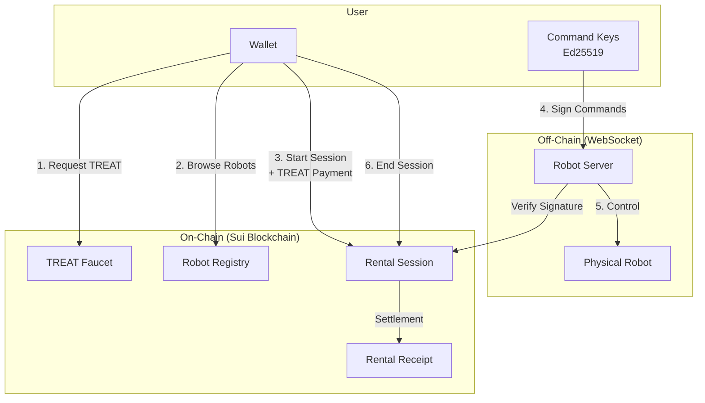
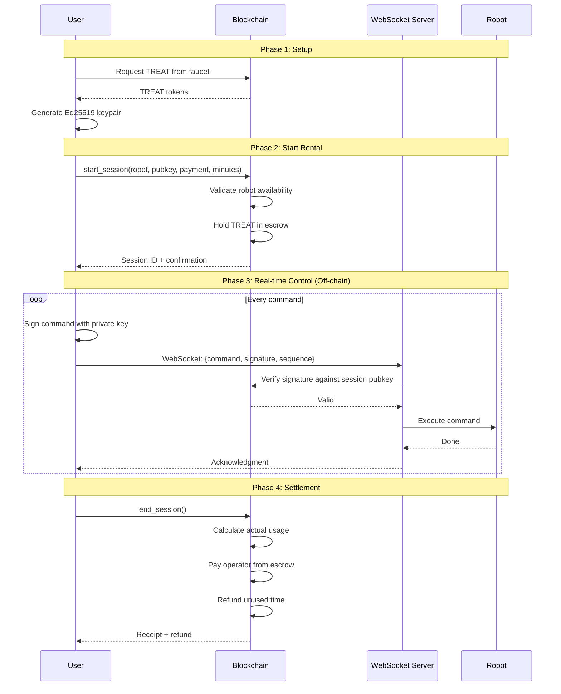
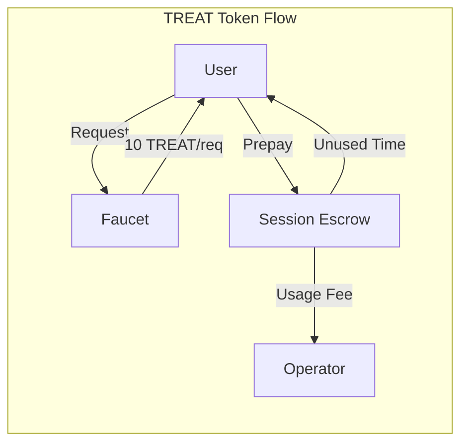
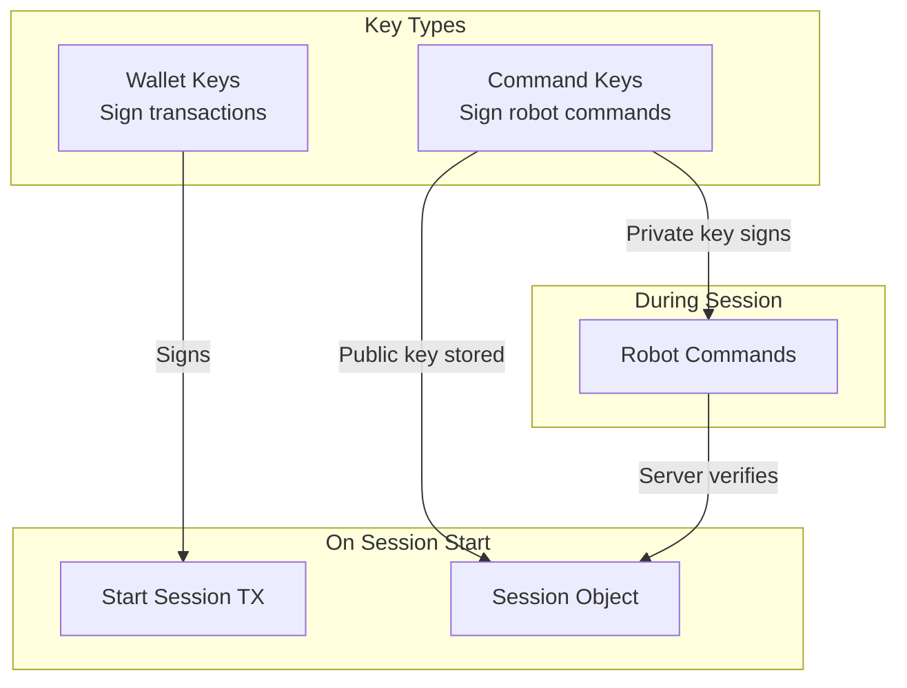
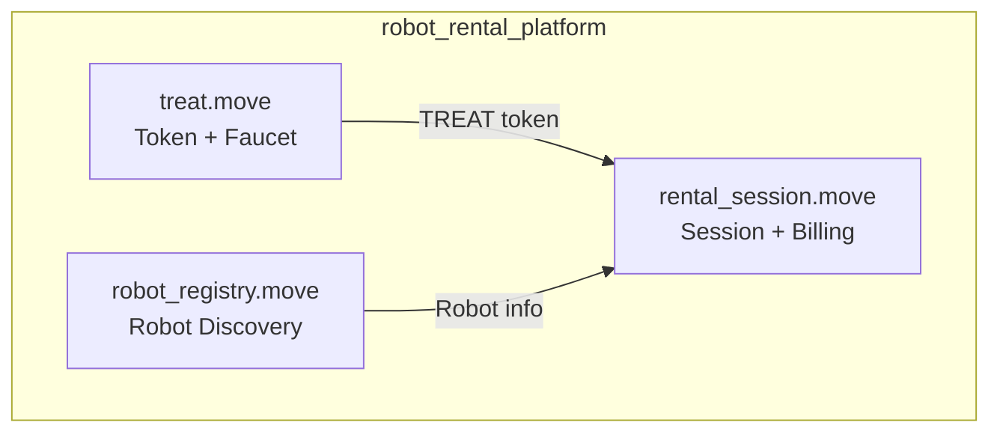
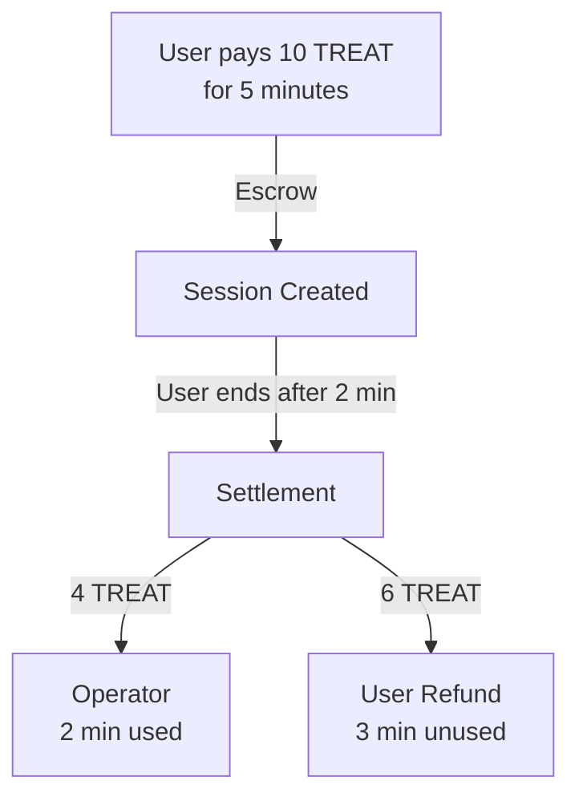
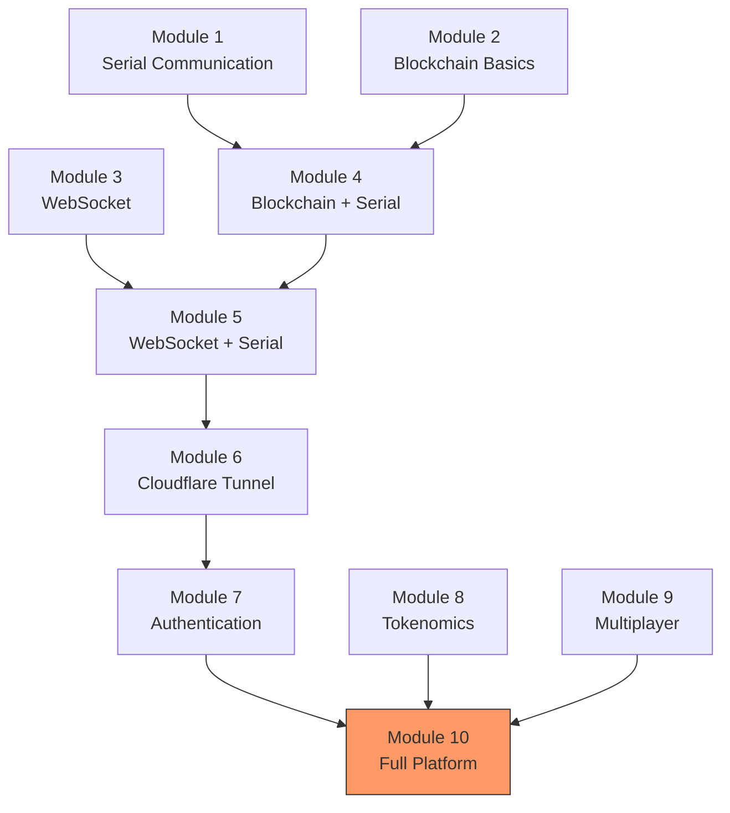

# Module 10: Robot Rental Platform - Full Stack Capstone

This capstone module combines everything from Modules 1-9 into a complete robot rental platform:

- **Discovery**: Browse available robots in a registry
- **Authentication**: Ed25519 keypairs for secure command signing (from Module 7)
- **Payment**: TREAT tokens with escrow and automatic refunds (from Module 8)
- **Real-time Control**: Off-chain command signing with on-chain settlement (state channels)

## Table of Contents

1. [Architecture Overview](#architecture-overview)
2. [How It Works](#how-it-works)
3. [Prerequisites](#prerequisites)
4. [Quick Start](#quick-start)
5. [Smart Contracts](#smart-contracts)
6. [Client Scripts](#client-scripts)
7. [Key Concepts](#key-concepts)
8. [Learning Path](#learning-path)
9. [Troubleshooting](#troubleshooting)

---

## Architecture Overview



### The Complete Flow



---

## How It Works

### 1. Token Economy



- **TREAT Token**: Platform currency (1 TREAT = 1 minute of robot rental)
- **Faucet**: Rate-limited (10/request, 100/day per user)
- **Escrow**: Prepaid tokens held until session ends
- **Settlement**: Automatic calculation and distribution

### 2. Authentication (Building on Module 7)



**Why separate keys?**

1. **Security**: If command key is compromised, wallet is safe
2. **Performance**: Sign commands locally without wallet interaction
3. **Flexibility**: Different devices can have different command keys

### 3. State Channels for Real-time Control

Traditional blockchain control would be too slow:

```
User → Blockchain → Robot
       ~5 seconds per command 😢
```

With state channels (like Module 7's tunnels):

```
1. OPEN session on-chain (one transaction)
2. Send unlimited commands off-chain (50ms each!) ⚡
3. CLOSE session on-chain (one transaction)
```

---

## Prerequisites

- **Node.js 18+** and **pnpm**
- **Sui CLI** (`cargo install --locked --git https://github.com/MystenLabs/sui.git sui`)
- A Sui wallet with testnet SUI (get from [faucet](https://faucet.sui.io/))

---

## Quick Start

### 1. Deploy Contracts

```bash
# Navigate to move directory
cd move

# Build contracts
sui move build

# Deploy to testnet
sui client publish --gas-budget 100000000

# Note the package ID and created object IDs from output
```

### 2. Configure Client

```bash
cd ../client

# Install dependencies
pnpm install

# Copy and edit environment file
cp .env.example .env

# Edit .env with your values:
# - PACKAGE_ADDRESS: Package ID from deployment
# - FAUCET_ID: Faucet object ID (from publish output)
# - REGISTRY_ID: (set after creating registry)
# - USER_PHRASE: Your wallet mnemonic
```

### 3. Setup Platform

```bash
# Create the robot registry (one-time)
pnpm create-registry
# → Copy REGISTRY_ID to .env

# Request TREAT tokens
pnpm request-tokens

# Check balance
pnpm check-balance
```

### 4. Register a Robot (as Operator)

```bash
# Set robot info in .env
# ROBOT_NAME=My-Bittle
# ROBOT_PRICE_PER_MINUTE=2

pnpm register-robot
# → Save the OPERATOR_COMMAND_PRIVATE_KEY for your server!
```

### 5. Start a Rental Session (as User)

```bash
# List available robots
pnpm list-robots

# Start a session
pnpm start-session My-Bittle 5
# → Save SESSION_ID and USER_COMMAND_PRIVATE_KEY

# End the session when done
pnpm end-session <SESSION_ID>
```

### 6. Run the Full Demo

```bash
pnpm demo
```

This demonstrates the complete flow:

1. Request TREAT from faucet
2. Register a demo robot
3. List available robots
4. Start rental session
5. Sign demo commands (off-chain)
6. End session with settlement

---

## Smart Contracts

### Contract Architecture



### treat.move

**Purpose**: Platform currency with rate-limited faucet

```move
// Key structures
struct Faucet has key {
    treasury_cap: TreasuryCap<TREAT>,
    user_records: Table<address, UserMintRecord>,
}

// Key functions
public fun request_tokens(
    faucet: &mut Faucet,
    amount: u64,          // 1-10
    clock: &Clock,
    ctx: &mut TxContext,
)
```

**Rate Limits**:

- 10 TREAT per request maximum
- 100 TREAT per day per user

### robot_registry.move

**Purpose**: Robot discovery and operator management

```move
// Key structures
struct RobotRegistry has key {
    robots: Table<String, RobotInfo>,
    robot_names: vector<String>,
}

struct RobotInfo has store, copy, drop {
    name: String,
    robot_type: String,
    operator: address,
    operator_public_key: vector<u8>,  // Ed25519 (32 bytes)
    price_per_minute: u64,
    is_available: bool,
}

// Key functions
public fun register_robot(...)
public fun unregister_robot(...)
public fun set_availability(...)
public fun get_robot(...) -> Option<RobotInfo>
```

### rental_session.move

**Purpose**: Session management with escrow and authentication

```move
// Key structures
struct RentalSession has key {
    robot_name: String,
    user: address,
    user_public_key: vector<u8>,       // For command verification
    operator: address,
    operator_public_key: vector<u8>,   // For mutual auth
    escrow: Balance<TREAT>,
    prepaid_minutes: u64,
    start_time: u64,
    sequence_number: u64,              // Replay protection
    is_active: bool,
}

struct RentalReceipt has key, store {
    actual_minutes: u64,
    amount_paid: u64,
    amount_refunded: u64,
}

// Key functions
public fun start_session(
    registry: &RobotRegistry,
    robot_name: String,
    user_public_key: vector<u8>,
    payment: Coin<TREAT>,
    minutes: u64,
    clock: &Clock,
    ctx: &mut TxContext,
)

public fun end_session(
    session: RentalSession,
    registry: &mut RobotRegistry,
    clock: &Clock,
    ctx: &mut TxContext,
)

// Signature verification (used by server)
public fun verify_user_signature(
    session: &RentalSession,
    signature: &vector<u8>,
    message: &vector<u8>,
) -> bool
```

---

## Client Scripts

| Script            | Description                  | Usage                                  |
| ----------------- | ---------------------------- | -------------------------------------- |
| `request-tokens`  | Get TREAT from faucet        | `pnpm request-tokens [amount]`         |
| `check-balance`   | View TREAT balance           | `pnpm check-balance`                   |
| `create-registry` | Create robot registry (once) | `pnpm create-registry`                 |
| `register-robot`  | Register a robot             | `pnpm register-robot`                  |
| `list-robots`     | List all robots              | `pnpm list-robots`                     |
| `start-session`   | Start rental                 | `pnpm start-session <robot> <minutes>` |
| `end-session`     | End rental                   | `pnpm end-session <session-id>`        |
| `demo`            | Full workflow demo           | `pnpm demo`                            |

---

## Key Concepts

### 1. Ed25519 Keypairs

```typescript
// Generate command-signing keys (NOT wallet keys!)
import * as ed from "@noble/ed25519";

const privateKey = ed.utils.randomPrivateKey();
const publicKey = await ed.getPublicKeyAsync(privateKey);

// Sign a command
const signature = await ed.signAsync(message, privateKey);

// Verify (done by server using on-chain public key)
const valid = await ed.verifyAsync(signature, message, publicKey);
```

### 2. Command Message Format

Commands must be signed in a specific format that matches the Move contract:

```
message = session_id (32 bytes) || sequence (8 bytes BE) || command
```

```typescript
function buildCommandMessage(
  sessionId: string,
  sequence: number,
  command: string,
): Uint8Array {
  const idBytes = hexToBytes(sessionId); // 32 bytes
  const sequenceBytes = bigEndian64(sequence); // 8 bytes
  const commandBytes = textEncode(command); // variable

  return concat(idBytes, sequenceBytes, commandBytes);
}
```

### 3. Escrow and Settlement



### 4. Sequence Numbers (Replay Protection)

Each command must have an incrementing sequence number:

```
Command 1: seq=1, "sit"      ✓
Command 2: seq=2, "wave"     ✓
Command 3: seq=2, "walk"     ✗ (replay attack!)
Command 4: seq=3, "walk"     ✓
```

---

## Learning Path

This module builds on everything from previous modules:



### What Each Module Contributed

| Module      | Contribution to Module 10                   |
| ----------- | ------------------------------------------- |
| Module 7    | Ed25519 authentication, state channels      |
| Module 8    | TREAT token, pay-per-action model           |
| Module 9    | Multi-user patterns, fairness (inspiration) |
| Modules 1-6 | Serial/WebSocket/Tunneling foundation       |

---

## Project Structure

```
Module10 - Full Platform/
├── README.md                 # This file
├── move/
│   ├── Move.toml
│   └── sources/
│       ├── treat.move        # TREAT token + faucet
│       ├── robot_registry.move   # Robot discovery
│       └── rental_session.move   # Session + billing
├── client/
│   ├── package.json
│   ├── tsconfig.json
│   ├── .env.example
│   └── src/
│       ├── config.ts         # Configuration + helpers
│       ├── request-tokens.ts
│       ├── check-balance.ts
│       ├── create-registry.ts
│       ├── register-robot.ts
│       ├── list-robots.ts
│       ├── start-session.ts
│       ├── end-session.ts
│       └── demo.ts           # Full workflow demo
├── server/                   # (Optional) WebSocket server
│   └── src/
│       └── ...
└── frontend/                 # (Optional) Web UI
    └── index.html
```

---

## Troubleshooting

### "ERobotNotAvailable"

The robot is either not registered or marked unavailable. Check `pnpm list-robots`.

### "EInsufficientPayment"

You don't have enough TREAT tokens. Run `pnpm request-tokens`.

### "EExceedsDailyLimit"

You've reached the 100 TREAT/day faucet limit. Wait until tomorrow.

### "ENotAuthorized"

Only the session's user or operator can end the session.

### "EInvalidSignature"

The command signature doesn't match the public key stored in the session.

- Verify you're using the correct private key
- Check the message format matches exactly

### "EInvalidSequence"

Sequence numbers must increment by exactly 1. Check for:

- Skipped sequence numbers
- Replay attacks (reused sequence)

---

## Next Steps

After completing this module, you could:

1. **Add a WebSocket Server**: Implement real-time command relay with signature verification
2. **Build a React dApp**: User-friendly interface for browsing and renting robots
3. **Integrate Physical Robot**: Connect to a real Petoi Bittle via serial port
4. **Add Cloudflare Tunnel**: Make your robot accessible from anywhere (Module 6)
5. **Implement Sponsorship**: Let operators sponsor user transactions (like the root project)

---

## Reference: Root Project

This module is a simplified version of the main Suifest Cookies project. For advanced features, see:

- `/move/` - Full Move contracts with more features
- `/dapp/` - Complete React application
- `/robot-rental/` - Production WebSocket server
- `/robot-pet-processor/` - Blockchain event processor

The main differences:

- Root has more robot types and actions
- Root has transaction sponsorship via Enoki
- Root has more sophisticated billing tiers
- Root supports ROS 2 for physical robot control
