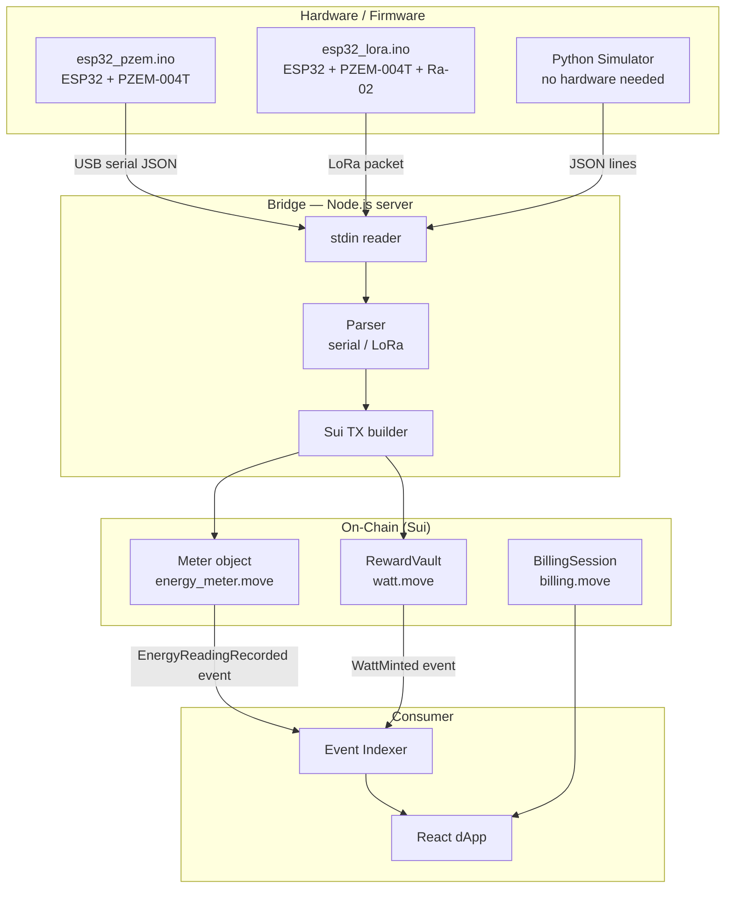
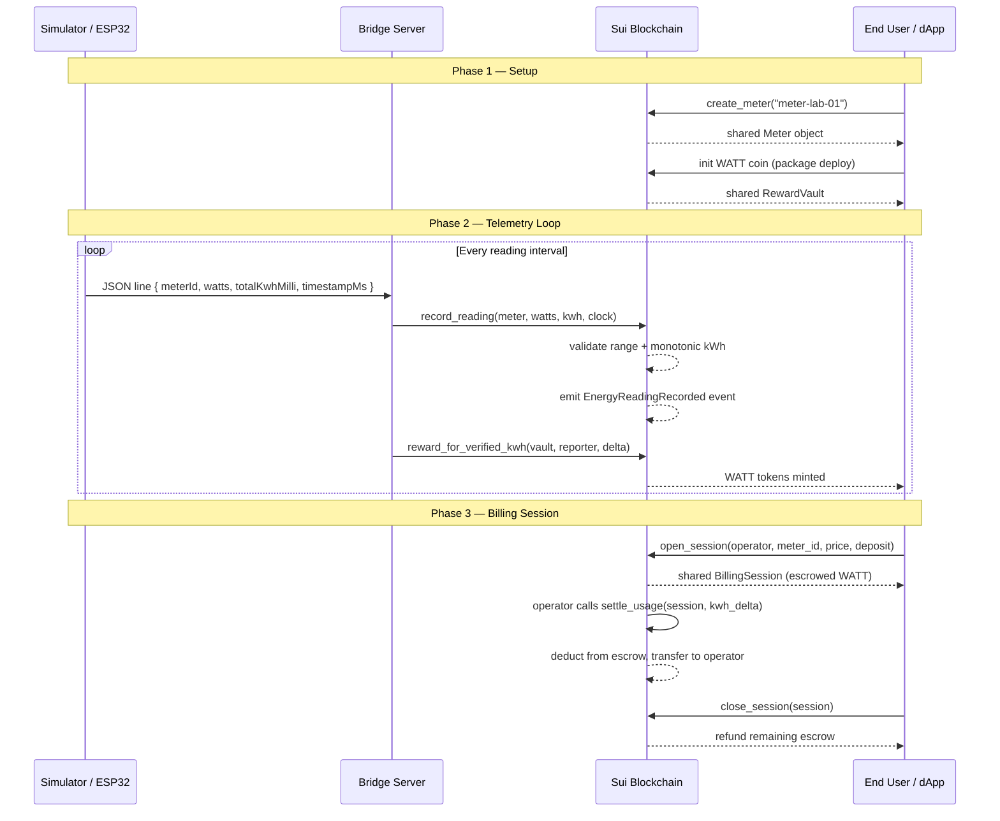
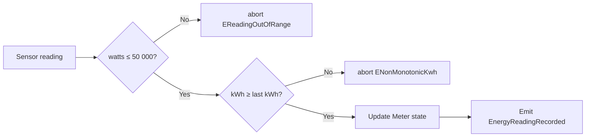
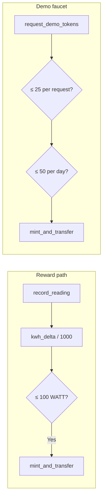
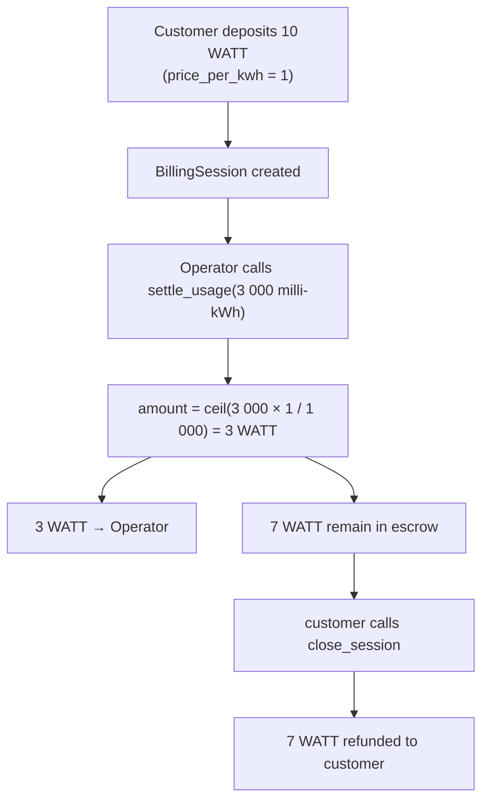
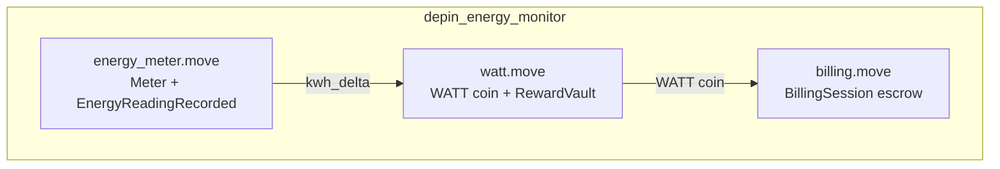
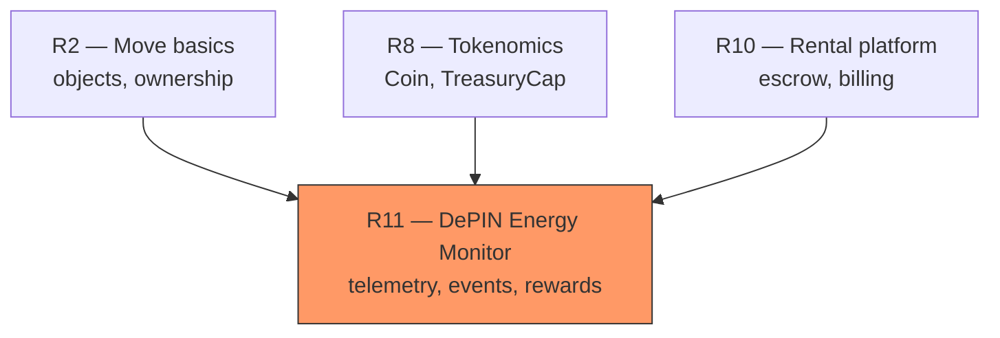

# Module R11: DePIN Energy Monitor

A complete DePIN (Decentralised Physical Infrastructure) module that teaches
on-chain telemetry, reward minting, and escrowed billing through an energy
meter use-case. The module ships with ESP32 firmware for real hardware and a
Python simulator so CI can validate everything without physical devices.

## Table of Contents

1. [Architecture Overview](#architecture-overview)
2. [How It Works](#how-it-works)
3. [Prerequisites](#prerequisites)
4. [Quick Start](#quick-start)
5. [Smart Contracts](#smart-contracts)
6. [Client Scripts](#client-scripts)
7. [Key Concepts](#key-concepts)
8. [Troubleshooting](#troubleshooting)
9. [Project Structure](#project-structure)
10. [Hardware Extension](#hardware-extension)
11. [Learning Path](#learning-path)

---

## Architecture Overview



### The Complete Flow



---

## How It Works

### 1. Energy Readings and Validation



Readings are validated before being committed. This prevents both sensor spikes
and rollback attacks on the cumulative kWh counter.

### 2. WATT Reward Token

WATT is a standard `Coin<WATT>` managed through `TreasuryCap`, consistent with
the R8/R10 approach. The `RewardVault` wraps the treasury and enforces:

- **Reward cap**: max 100 WATT per reading (1 WATT per kWh)
- **Demo faucet**: max 25 WATT per request, 50 WATT per day per user



### 3. Billing Session (Escrow)



Settlement uses **ceiling division** (`(kwh_milli × price + 999) / 1000`) so
operators are never underpaid by rounding.

---

## Prerequisites

- **Sui CLI** (`cargo install --locked --git https://github.com/MystenLabs/sui.git sui`)
- **Node.js 20+** and **pnpm**
- **Python 3.9+** (simulator — no extra packages)
- A Sui wallet funded with testnet SUI (get from [faucet.sui.io](https://faucet.sui.io/))
- **Arduino IDE 2 or `arduino-cli`** — only if flashing hardware firmware

---

## Quick Start

### 1. Build and test the Move package

```bash
cd R11/move
sui move build
sui move test
```

Expected: `Test result: OK. Total tests: 7; passed: 7; failed: 0`

### 1b. Flash firmware (skip if using simulator)

See [`firmware/README.md`](./firmware/README.md) for full flash instructions.

```bash
# Direct wired path (ESP32 + PZEM-004T)
arduino-cli compile --fqbn esp32:esp32:esp32 firmware/esp32_pzem/
arduino-cli upload  --fqbn esp32:esp32:esp32 --port /dev/ttyUSB0 firmware/esp32_pzem/

# LoRa path
arduino-cli compile --fqbn esp32:esp32:esp32 firmware/esp32_lora/
arduino-cli upload  --fqbn esp32:esp32:esp32 --port /dev/ttyUSB0 firmware/esp32_lora/
```

### 2. Publish contracts

```bash
cd ../publish
chmod +x publish.sh
./publish.sh
```

Note the **Package ID** and the **Meter object ID** and **RewardVault ID** from
the output. Copy them into:

- `server/.env`
- `client/.env`
- `dapp/.env`

### 3. Run the bridge

```bash
cd ../server
pnpm install
cp .env.example .env
# Fill PACKAGE_ADDRESS and METER_OBJECT_ID
```

**With hardware** (direct wired):
```bash
cat /dev/ttyUSB0 | pnpm dev
```

**With hardware** (LoRa gateway):
```bash
TRANSPORT=lora <gateway-output> | pnpm dev
```

**Without hardware** (simulator):
```bash
python3 ../simulator/energy_sim.py --count 5 | pnpm dev
```

Leave `AUTO_SUBMIT` unset to print a dry-run description without sending transactions.

### 4. Submit readings on-chain

Set `AUTO_SUBMIT=true` and add your wallet credentials to `server/.env`:

```bash
# server/.env
AUTO_SUBMIT=true
USER_PHRASE="your twelve word mnemonic ..."
REWARD_VAULT_ID=0x...
```

Then run again:

```bash
python3 ../simulator/energy_sim.py --count 5 | pnpm dev
```

### 5. Request demo WATT tokens

```bash
cd ../client
pnpm install
cp .env.example .env
# Fill PACKAGE_ADDRESS, REWARD_VAULT_ID, USER_PHRASE

pnpm request-demo-tokens -- 10
pnpm check-balance
```

### 6. Submit a reading manually

```bash
pnpm submit-reading -- 500 12 12
# args: watts  total_kwh_milli  meter_object_id (positional)
```

### 7. Build the dApp

```bash
cd ../dapp
pnpm install
cp .env.example .env
# Fill VITE_PACKAGE_ID and VITE_METER_OBJECT_ID

pnpm build
pnpm dev    # opens http://localhost:5173
```

---

## Smart Contracts

### Contract Architecture



### energy_meter.move

**Purpose**: Shared `Meter` object that validates and records energy readings as
Sui events.

```move
public struct Meter has key {
    id: UID,
    meter_id: String,
    owner: address,
    last_timestamp_ms: u64,
    last_kwh_milli: u64,   // cumulative, must be monotonic
    last_watts: u64,
}

public struct EnergyReadingRecorded has copy, drop {
    meter_id: String,
    watts: u64,
    total_kwh_milli: u64,
    timestamp_ms: u64,
    reporter: address,
}

// Key functions
public fun create_meter(meter_id: String, ctx: &mut TxContext)
public fun record_reading(meter: &mut Meter, watts: u64, total_kwh_milli: u64,
                          clock: &Clock, ctx: &mut TxContext)
```

**Error codes**:

| Constant | Code | Meaning |
|---|---|---|
| `EReadingOutOfRange` | 0 | `watts > 50 000` |
| `ENonMonotonicKwh` | 1 | `total_kwh_milli < last_kwh_milli` |
| `EUnauthorizedReporter` | 2 | sender ≠ `meter.owner` |

### watt.move

**Purpose**: `WATT` reward coin with a shared treasury, rate-limited demo
faucet, and reward minting for verified kWh.

```move
public struct RewardVault has key {
    id: UID,
    treasury_cap: TreasuryCap<WATT>,
    demo_records: Table<address, UserMintRecord>,
    max_reward_per_reading: u64,   // default 100
}

// Key functions
public fun reward_for_verified_kwh(vault: &mut RewardVault, recipient: address,
                                   kwh_milli_delta: u64, ctx: &mut TxContext)
public fun request_demo_tokens(vault: &mut RewardVault, amount: u64,
                                clock: &Clock, ctx: &mut TxContext)
public fun burn_for_settlement(vault: &mut RewardVault, payment: Coin<WATT>)
```

**Error codes**:

| Constant | Code | Meaning |
|---|---|---|
| `ERewardTooLarge` | 0 | `amount > max_reward_per_reading` |
| `EExceedsDemoLimit` | 1 | daily allowance exhausted |
| `EExceedsRequestLimit` | 2 | single request > 25 WATT |

### billing.move

**Purpose**: Pay-per-kWh billing using a `BillingSession` shared object that
holds an escrowed `Balance<WATT>` on behalf of a customer.

```move
public struct BillingSession has key {
    id: UID,
    meter_id: String,
    customer: address,
    operator: address,
    price_per_kwh: u64,
    escrow: Balance<WATT>,
    consumed_kwh_milli: u64,
    total_charged: u64,
    is_active: bool,
}

// Key functions
public fun open_session(operator: address, meter_id: String, price_per_kwh: u64,
                        deposit: Coin<WATT>, ctx: &mut TxContext)
public fun settle_usage(session: &mut BillingSession, additional_kwh_milli: u64,
                        ctx: &mut TxContext)
public fun close_session(session: BillingSession, ctx: &mut TxContext)
```

**Error codes**:

| Constant | Code | Meaning |
|---|---|---|
| `ENotAuthorized` | 0 | sender is not customer or operator |
| `ESessionInactive` | 1 | session already closed |
| `EInsufficientEscrow` | 2 | escrow cannot cover charge |
| `EOperatorOnly` | 3 | only operator may call `settle_usage` |

---

## Client Scripts

| Script | Description | Usage |
|---|---|---|
| `request-demo-tokens` | Get WATT from demo faucet | `pnpm request-demo-tokens -- <amount>` |
| `submit-reading` | Submit an energy reading on-chain | `pnpm submit-reading -- <watts> <kwh_milli>` |
| `check-balance` | View WATT balance | `pnpm check-balance` |
| `demo` | Full faucet → reading → balance flow | `pnpm demo` |

---

## Key Concepts

### 1. Milli-kWh precision

The Move contract stores energy in **milli-kWh** (1 kWh = 1 000 milli-kWh) to
avoid floating point while preserving sub-kWh granularity. Rewards are minted
as whole WATT (1 WATT per kWh), so a delta of 2 500 milli-kWh yields 2 WATT
(`2500 / 1000 = 2`, integer division).

### 2. Monotonic kWh enforcement

Real energy meters accumulate kWh over their lifetime. A reading with a lower
total than the previous one is either a bug or a replay attack, so the contract
aborts with `ENonMonotonicKwh`.

### 3. Ceiling division in billing

```
amount_charged = (kwh_milli × price_per_kwh + 999) / 1000
```

This ensures operators never receive less than one WATT for partial kWh
consumption. For example, 1 500 milli-kWh at 1 WATT/kWh charges 2 WATT (not
1), so operators are always fairly compensated.

### 4. Universal transport abstraction

The bridge server reads from `stdin`, expecting one JSON line per interval.
Because this is a pure text interface, the bridge does not care whether the
data comes from the Python simulator or the real ESP32 firmware — they both
produce identical JSON over stdout/serial.

```json
{"meterId":"meter-lab-01","watts":320,"totalKwhMilli":5,"timestampMs":1700000000000}
```

This makes swapping transports trivial:

```bash
# Simulator path
python3 simulator/energy_sim.py --count 10 | pnpm dev

# Hardware path (direct wired)
cat /dev/ttyUSB0 | pnpm dev

# Hardware path (LoRa gateway)
TRANSPORT=lora <gateway-output> | pnpm dev
```

---

## Troubleshooting

### `EReadingOutOfRange`

The submitted `watts` value exceeds 50 000. Check the sensor or simulator output.

### `ENonMonotonicKwh`

The cumulative `total_kwh_milli` decreased relative to the last reading stored
in the Meter object. This can happen if:

- The simulator was restarted with `--start-ms` that resets the counter.
- A different meter object ID was used in a previous session.

Create a fresh meter with `create_meter` or reset the simulator state.

### `EExceedsDemoLimit`

The demo faucet allows 50 WATT per address per calendar day (UTC). Wait until
the next day or check `remaining_daily_allowance` via the client.

### `EInsufficientEscrow`

The billing session's escrow balance is too low to cover the requested
settlement. Either close the session or open a new one with a larger deposit.

### `Missing required configuration: PACKAGE_ADDRESS`

The bridge exits if `PACKAGE_ADDRESS` is not set. Copy `.env.example` to `.env`
and fill in the values from your publish output.

### TypeScript build error: `Cannot find module '...'`

Run `pnpm install` in the failing package directory (`server/`, `client/`, or
`dapp/`). The `dist/` directory is gitignored; run `pnpm build` before `pnpm dev`.

---

## Project Structure

```
R11/
├── README.md                         # This file
├── PULL_REQUEST.md
├── e2e-test-flow.md                  # Copy-paste end-to-end guide
├── move/
│   ├── Move.toml
│   ├── Move.lock
│   ├── sources/
│   │   ├── energy_meter.move         # Meter object + readings
│   │   ├── watt.move                 # WATT coin + RewardVault
│   │   └── billing.move              # Escrowed billing session
│   └── tests/
│       ├── energy_meter_tests.move
│       ├── watt_tests.move
│       └── billing_tests.move
├── firmware/
│   ├── README.md                     # Flash instructions
│   ├── esp32_pzem/
│   │   └── esp32_pzem.ino            # ESP32 + PZEM-004T → USB serial
│   └── esp32_lora/
│       └── esp32_lora.ino            # ESP32 + PZEM-004T + Ra-02 LoRa
├── publish/
│   └── publish.sh                    # Deploy and print object IDs
├── simulator/
│   ├── energy_sim.py                 # Deterministic reading generator
│   └── lora_sim.py                   # LoRa-wrapped packet generator
├── server/
│   ├── package.json
│   ├── tsconfig.json
│   ├── .env.example
│   └── src/
│       ├── server.ts                 # stdin reader + HTTP status
│       ├── config.ts                 # Env config + validation
│       ├── energy.ts                 # Reading parser + delta
│       ├── serial.ts                 # JSON line parser
│       ├── lora.ts                   # LoRa packet unwrapper
│       ├── sui.ts                    # TX builder + signer
│       ├── types.ts                  # Shared TypeScript types
│       └── server.test.ts            # Unit tests (node:test)
├── client/
│   ├── package.json
│   ├── tsconfig.json
│   ├── .env.example
│   └── src/
│       ├── config.ts
│       ├── request-demo-tokens.ts
│       ├── submit-reading.ts
│       ├── check-balance.ts
│       └── demo.ts
├── dapp/
│   ├── package.json
│   ├── index.html
│   ├── vite.config.mts
│   ├── .env.example
│   └── src/
│       ├── main.tsx
│       ├── App.tsx
│       └── networkConfig.ts
└── docs/
    ├── architecture.md
    ├── wiring_esp32_pzem.md          # AC meter wiring guide
    └── wiring_esp32_lora.md          # LoRa radio wiring guide
```

---

## Hardware

Two firmware paths are provided in [`firmware/`](./firmware/):

### Path A — Direct serial (ESP32 + PZEM-004T)

Sketch: [`firmware/esp32_pzem/esp32_pzem.ino`](./firmware/esp32_pzem/esp32_pzem.ino)

The ESP32 reads the PZEM-004T meter over UART2 and emits JSON lines on USB.
The R11 bridge reads these from `stdin` with `TRANSPORT=serial` (default).

```text
PZEM-004T → ESP32 (UART2) → USB → cat /dev/ttyUSB0 | bridge server → Sui
```

Wiring: [`docs/wiring_esp32_pzem.md`](./docs/wiring_esp32_pzem.md)

### Path B — LoRa uplink (ESP32 + PZEM-004T + Ra-02)

Sketch: [`firmware/esp32_lora/esp32_lora.ino`](./firmware/esp32_lora/esp32_lora.ino)

The ESP32 transmits each reading as a LoRa packet. A receiving gateway
(another ESP32 or a LoRaWAN server) forwards the packet to the bridge
with `TRANSPORT=lora`.

```text
PZEM-004T → ESP32 → LoRa → gateway → bridge server → Sui
```

Wiring: [`docs/wiring_esp32_lora.md`](./docs/wiring_esp32_lora.md)

### Hardware bill of materials

| Component | Role | Example reference |
|---|---|---|
| ESP32 DevKitC | Main MCU + WiFi | [Espressif ESP32-DevKitC](https://www.espressif.com/en/products/devkits/esp32-devkitc) |
| PZEM-004T | AC voltage/current/power meter | [Peacefair PZEM-004T](https://en.peacefair.cn/product/769.html) |
| SCT-013 | Clamp current transformer alternative | [YHDC SCT-013](https://en.yhdc.com/product/SCT013-401.html) |
| Ra-02 / SX1276 | LoRa radio uplink | [Ai-Thinker Ra-02 spec](https://docs.ai-thinker.com/_media/lora/docs/c048ps01a1_ra-02_product_specification_v1.1.pdf) |
| 5 V opto relay | Optional hardware cut-off demo | Any ESP32-compatible single-channel opto-relay |

---

## Learning Path

This module extends the R-series with a DePIN focus:



### What each module contributes to R11

| Module | Contribution |
|---|---|
| R2 | Shared objects, Move basics, TypeScript SDK |
| R8 | WATT follows the same `Coin + TreasuryCap` pattern as COOKIE |
| R10 | `BillingSession` mirrors the R10 rental escrow flow |
| R1/R3/R6 | Transport abstraction (serial → stdin) |

### Stretch goals

- Add a Token Policy (`I3`) so WATT can only be spent in authorised billing sessions
- Replace the stdin bridge with a dedicated serial or LoRa transport abstraction
- Feed indexed readings into Grafana using the J3 monitoring stack
- Add Ed25519-signed sensor payloads (R7 pattern) to prevent spoofed readings

---

## Acceptance Checklist

- [x] `R11/README.md` documents prerequisites, quick start, and module scope
- [x] `R11/move` builds and tests with `sui move build` and `sui move test`
- [x] `R11/server` builds and tests with `pnpm build` and `pnpm test`
- [x] `R11/client` builds with `pnpm build`
- [x] `R11/dapp` builds with `pnpm build`
- [x] Simulation mode works end-to-end without physical hardware
- [x] Root `README.md` references `R11`
- [ ] The completed implementation is mirrored in `R11-solution`
