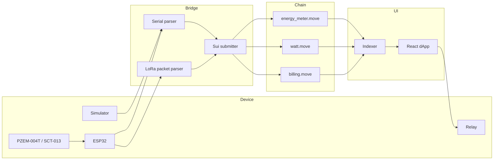

# R11 Architecture

`R11` is structured to let learners swap transport layers without changing the
core on-chain model.

## Why this shape

- `move/` stays small and testable, focusing on validation, rewards, and billing
- `server/` owns transport normalization so learners can start with stdin or
  JSON and add hardware later
- `simulator/` makes the module deterministic enough for CI and review
- `dapp/` mirrors the R9/R10 wallet pattern instead of inventing a new stack
