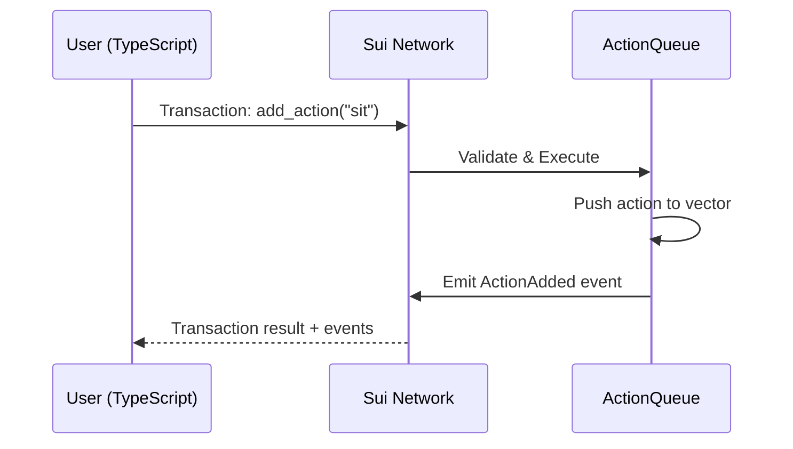
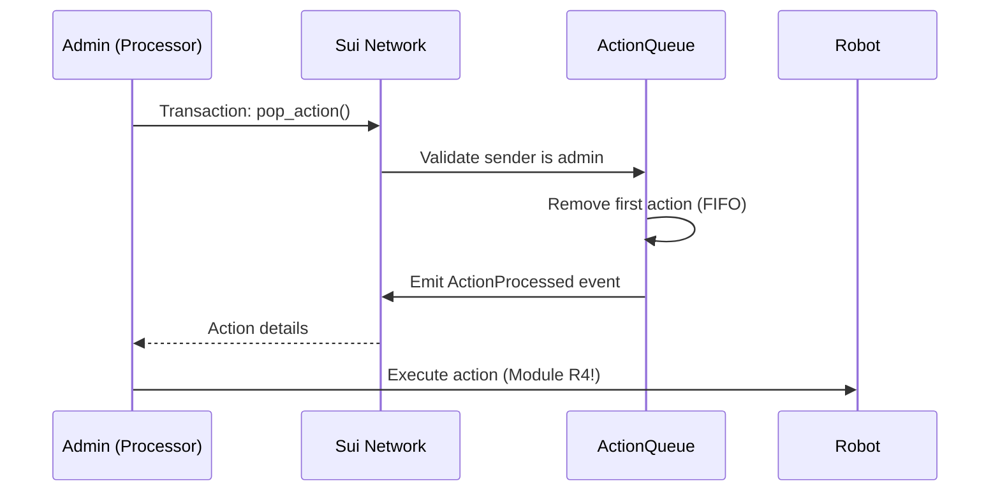

# Module 2: My First Move Contract - Blockchain Fundamentals

Build a simple action queue on the Sui blockchain. No tokens, no complexity - just the fundamentals.

**Goal**: Understand how to write, deploy, and interact with Sui Move smart contracts.

**Time**: 2-3 hours

**Prerequisites**:

- [Sui CLI installed](https://docs.sui.io/guides/developer/getting-started/sui-install)
- Node.js 18+
- A Sui wallet with testnet SUI tokens

---

## What You will Learn

1. What is a blockchain and why use it
2. Sui Move language basics
3. Objects, ownership, and shared state
4. Writing and deploying a smart contract
5. Interacting with contracts from TypeScript

---

## Quick Start

```bash
# 1. Deploy the contract
cd move
sui client publish --gas-budget 100000000

# 2. Configure the client
cd ../client
cp .env.example .env
# Edit .env with your PACKAGE_ADDRESS and ADMIN_PHRASE

# 3. Create a queue
pnpm install
pnpm create-queue
# Copy the QUEUE_ID to your .env

# 4. Run the demo
pnpm demo
```

---

## Part 1: Understanding Blockchain Basics

### What is a Blockchain?

A blockchain is a shared database that:

- **Everyone can read** - All data is public and verifiable
- **No one controls** - No single entity can modify or censor
- **Append-only** - Once written, data cannot be changed

Think of it as a public bulletin board where anyone can post, but no one can erase.

```
┌─────────────────────────────────────────────────────────────┐
│                    BLOCKCHAIN                               │
│  ┌─────────┐    ┌─────────┐    ┌─────────┐    ┌─────────┐   │
│  │ Block 1 │───▶│ Block 2 │───▶│ Block 3 │───▶│ Block 4 │   │
│  │ tx: sit │    │ tx: wave│    │ tx: jump│    │ tx: ... │   │
│  └─────────┘    └─────────┘    └─────────┘    └─────────┘   │
│                                                             │
│  Anyone can add transactions                                │
│  No one can remove or modify past transactions              │
└─────────────────────────────────────────────────────────────┘
```

### Why Use Blockchain for Robots?

1. **Shared State**: Multiple users can queue actions without conflicts
2. **Transparency**: Everyone sees the same queue
3. **Trustless**: No central server needed
4. **Permanence**: Action history is preserved forever

### Sui vs Other Blockchains

Sui is designed for speed and usability:

| Feature            | Ethereum      | Sui          |
| ------------------ | ------------- | ------------ |
| Transaction Speed  | ~15 seconds   | ~0.5 seconds |
| Programming Model  | Account-based | Object-based |
| Language           | Solidity      | Move         |
| Parallel Execution | No            | Yes          |

---

## Part 2: Sui Move Language Basics

### What is Move?

Move is a programming language designed for blockchain. It focuses on:

- **Safety**: Prevents common bugs like double-spending
- **Resources**: Digital assets that cannot be copied or lost
- **Objects**: Everything is an object with a unique ID

### Module Structure

Every Move file follows this structure:

```move
/// Documentation comment
module package_name::module_name;

// Imports
use sui::object;
use std::string::String;

// Constants
const ERROR_CODE: u64 = 0;

// Structs (data types)
public struct MyObject has key {
    id: UID,
    data: u64,
}

// Functions
public fun my_function() {
    // ...
}

// Entry functions (callable from transactions)
public entry fun my_entry_function(ctx: &mut TxContext) {
    // ...
}
```

### Key Concepts

#### 1. Abilities

Move types have "abilities" that control what you can do with them:

| Ability | Meaning                                         |
| ------- | ----------------------------------------------- |
| `key`   | Can be stored as a Sui object (has a unique ID) |
| `store` | Can be stored inside other objects              |
| `copy`  | Can be copied                                   |
| `drop`  | Can be discarded/destroyed                      |

```move
// A Sui object (has key)
public struct MyObject has key {
    id: UID,
}

// Can be stored in objects, copied, dropped
public struct MyData has store, copy, drop {
    value: u64,
}
```

#### 2. Object Ownership

Sui objects can be:

```
┌──────────────────────────────────────────────────────────────┐
│                     OBJECT OWNERSHIP                         │
├──────────────────────────────────────────────────────────────┤
│                                                              │
│  OWNED OBJECTS              SHARED OBJECTS                   │
│  ─────────────              ──────────────                   │
│  • Belong to one address    • Anyone can access              │
│  • Only owner can modify    • Anyone can modify              │
│  • Fast (no consensus)      • Slower (needs consensus)       │
│                                                              │
│  Example: Your wallet       Example: Action Queue            │
│                                                              │
└──────────────────────────────────────────────────────────────┘
```

Our ActionQueue is a **shared object** because anyone should be able to add actions.

#### 3. Entry Functions

Entry functions are the "API" of your contract - they can be called from transactions:

```move
// Can be called from a transaction
public entry fun add_action(
    queue: &mut ActionQueue,  // Mutable reference to shared object
    action_name: String,      // Parameter from transaction
    ctx: &TxContext,          // Transaction context (sender, etc.)
) {
    // ...
}
```

#### 4. Events

Events are notifications emitted when things happen:

```move
public struct ActionAdded has copy, drop {
    action_name: String,
    sender: address,
}

// Emit an event
event::emit(ActionAdded {
    action_name: b"sit".to_string(),
    sender: ctx.sender(),
});
```

Events are **not stored on-chain** but can be queried from indexers.

---

## Part 3: Our Contract Explained

### The Action Struct

```move
public struct Action has store, copy, drop {
    name: String,      // Action name like "sit", "wave"
    sender: address,   // Who added this action
    timestamp: u64,    // When it was added
}
```

- `store`: Can be put inside the queue vector
- `copy`: Can be copied when reading
- `drop`: Can be discarded after processing

### The ActionQueue Struct

```move
public struct ActionQueue has key {
    id: UID,                        // Unique identifier
    actions: vector<Action>,        // The queue (FIFO)
    total_actions_added: u64,       // Statistics
    total_actions_processed: u64,
    admin: address,                 // Who can pop actions
}
```

- `key`: This is a Sui object
- `id: UID`: Required for all Sui objects

### Creating the Queue

```move
public fun create_queue(ctx: &mut TxContext) {
    let queue = ActionQueue {
        id: object::new(ctx),        // Generate unique ID
        actions: vector::empty(),    // Empty queue
        total_actions_added: 0,
        total_actions_processed: 0,
        admin: ctx.sender(),         // Creator is admin
    };

    // Make it a shared object (anyone can access)
    transfer::share_object(queue);
}
```

### Adding Actions

```move
public fun add_action(
    queue: &mut ActionQueue,         // Mutable ref to queue
    action_name: String,
    clock: &Clock,                   // System clock
    ctx: &TxContext,
) {
    let action = Action {
        name: action_name,
        sender: ctx.sender(),
        timestamp: clock.timestamp_ms(),
    };

    queue.actions.push_back(action);  // Add to end
    queue.total_actions_added = queue.total_actions_added + 1;

    event::emit(ActionAdded { ... });
}
```

### Popping Actions

```move
public fun pop_action(
    queue: &mut ActionQueue,
    ctx: &TxContext,
) {
    // Only admin can pop
    assert!(ctx.sender() == queue.admin, ENotAuthorized);

    // Remove from front (FIFO)
    let action = queue.actions.remove(0);
    queue.total_actions_processed = queue.total_actions_processed + 1;

    event::emit(ActionProcessed { ... });
}
```

---

## Part 4: Deploying the Contract

### Step 1: Check Your Wallet

```bash
# Show your address
sui client active-address

# Check your balance
sui client balance

# If you need testnet SUI, use the faucet:
# https://faucet.sui.io/
```

### Step 2: Build the Contract

```bash
cd R2/move
sui move build
```

This compiles your Move code and checks for errors.

### Step 3: Deploy (Publish)

```bash
sui client publish --gas-budget 100000000
```

You will see output like:

```
╭─────────────────────────────────────────────────────────────╮
│ Transaction Digest: ABC123...                               │
├─────────────────────────────────────────────────────────────┤
│ Published Objects:                                          │
│  Package ID: 0x1234567890abcdef...                          │
╰─────────────────────────────────────────────────────────────╯
```

Save the **Package ID** - this is your `PACKAGE_ADDRESS`.

### Step 4: Verify on Explorer

Visit: `https://suiscan.xyz/testnet/object/<PACKAGE_ADDRESS>`

You should see your published module.

---

## Part 5: TypeScript Client

### Architecture

```
┌─────────────────┐     Transaction      ┌─────────────────┐
│   TypeScript    │ ──────────────────▶  │  Sui Network    │
│     Client      │                      │                 │
│                 │ ◀──────────────────  │  ActionQueue    │
│  @mysten/sui    │     Response/Event   │    (shared)     │
└─────────────────┘                      └─────────────────┘
```

### Setting Up

```typescript
import { SuiClient, getFullnodeUrl } from "@mysten/sui/client";
import { Ed25519Keypair } from "@mysten/sui/keypairs/ed25519";

// Connect to the network
const client = new SuiClient({
  url: getFullnodeUrl("testnet"),
});

// Create keypair from mnemonic
const keypair = Ed25519Keypair.deriveKeypair(
  "your twelve word mnemonic phrase...",
);
```

### Building Transactions

```typescript
import { Transaction } from "@mysten/sui/transactions";

// Create transaction
const tx = new Transaction();

// Call a Move function
tx.moveCall({
  target: `${packageAddress}::robot_queue::add_action`,
  arguments: [
    tx.object(queueId), // Object reference
    tx.pure.string("sit"), // String argument
    tx.object(SUI_CLOCK_OBJECT_ID), // Clock object (always 0x6)
  ],
});

// Sign and execute
const result = await client.signAndExecuteTransaction({
  transaction: tx,
  signer: keypair,
});
```

### Reading Object Data

```typescript
// Fetch object from chain
const response = await client.getObject({
  id: queueId,
  options: { showContent: true },
});

// Parse the data
const fields = response.data.content.fields;
console.log("Pending actions:", fields.actions.length);
```

---

## Part 6: Data Flow

### Adding an Action



### Processing the Queue



---

## Part 7: Complete Example

### Run the Demo

```bash
cd client
pnpm demo
```

Output:

```
==================================================
ACTION QUEUE DEMO
==================================================

1. Reading initial queue state...

   Pending actions: 0
   Total added: 0
   Total processed: 0

2. Adding actions to queue...

   Adding "sit"... done
   Adding "wave"... done
   Adding "walk_forward"... done
   Adding "jump"... done

3. Reading updated queue state...

   Pending actions: 4
   Queue contents: [sit, wave, walk_forward, jump]

4. Processing actions (FIFO order)...

   Processed: "sit"
   Processed: "wave"
   Processed: "walk_forward"
   Processed: "jump"

5. Final queue state...

   Pending actions: 0
   Total added: 4
   Total processed: 4

==================================================
DEMO COMPLETE
==================================================
```

---

## Project Structure

```
R2/
├── README.md                 # This file
├── move/
│   ├── Move.toml             # Package configuration
│   └── sources/
│       └── action_queue.move # The smart contract
└── client/
    ├── package.json
    ├── tsconfig.json
    ├── .env.example
    └── src/
        ├── config.ts         # Sui client setup
        ├── create-queue.ts   # Create shared queue
        ├── add-action.ts     # Add action to queue
        ├── read-queue.ts     # Read queue state
        ├── pop-action.ts     # Process next action
        └── demo.ts           # Full workflow demo
```

---

## Exercises

### Exercise 1: Add Priority

Modify the Action struct to include a priority field:

```move
public struct Action has store, copy, drop {
    name: String,
    sender: address,
    timestamp: u64,
    priority: u8,  // 0 = low, 1 = medium, 2 = high
}
```

### Exercise 2: Action Limit

Add a maximum queue size:

```move
const MAX_QUEUE_SIZE: u64 = 100;

public fun add_action(...) {
    assert!(queue.actions.length() < MAX_QUEUE_SIZE, EQueueFull);
    // ...
}
```

### Exercise 3: User Stats

Track how many actions each user has added:

```move
use sui::table::Table;

public struct ActionQueue has key {
    // ...
    user_stats: Table<address, u64>,
}
```

---

## Common Errors

### "Insufficient gas"

Increase gas budget:

```bash
sui client publish --gas-budget 200000000
```

### "Object not found"

- Check the object ID is correct
- Make sure you are on the right network (testnet vs mainnet)

### "Not authorized"

Only the admin (queue creator) can pop actions. Check you are using the same wallet.

### "Move abort: 0"

Check the error codes in the contract:

- `0` = EQueueEmpty
- `1` = ENotAuthorized

---

## Key Takeaways

1. **Move is safe**: Resources cannot be copied or lost accidentally
2. **Objects are first-class**: Everything on Sui is an object with an ID
3. **Shared objects enable collaboration**: Multiple users can interact
4. **Events notify off-chain**: Use them to track what is happening
5. **TypeScript SDK is powerful**: Full access to Sui from any app

---

## Next Steps

Now that you understand blockchain basics, you are ready for:

- **Module 3**: Add WebSocket for real-time browser control
- **Module 4**: Combine blockchain + serial for the first robot integration

---

## Resources

- [Sui Move Documentation](https://docs.sui.io/concepts/sui-move-concepts)
- [Move Language Book](https://move-book.com/)
- [Sui TypeScript SDK](https://sdk.mystenlabs.com/typescript)
- [Sui Explorer (Testnet)](https://suiscan.xyz/testnet)
- [Sui Discord](https://discord.gg/sui)
