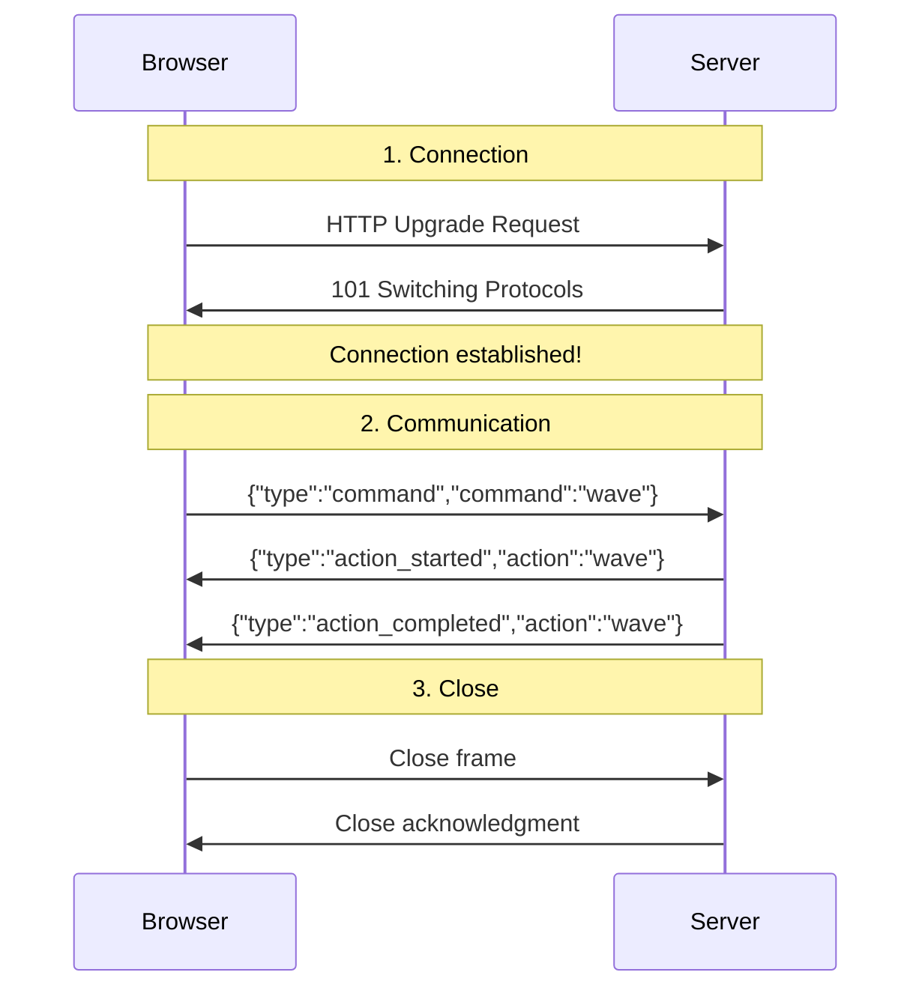
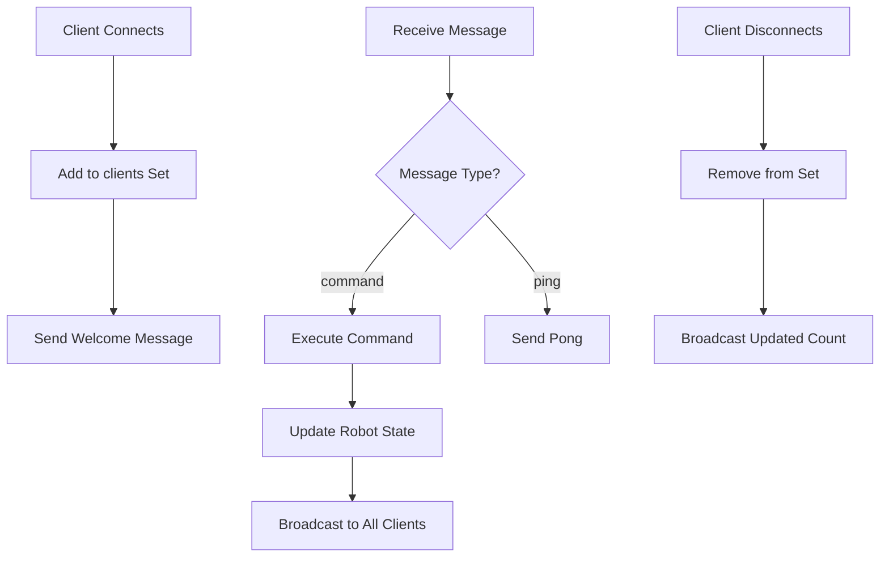
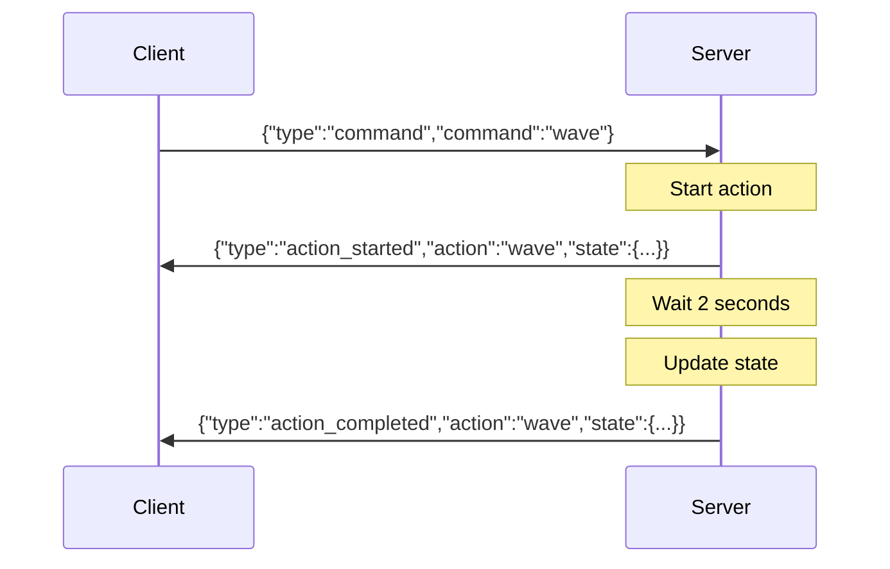
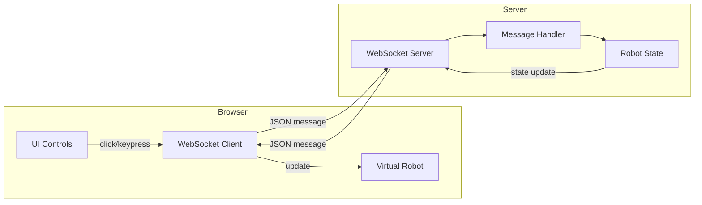
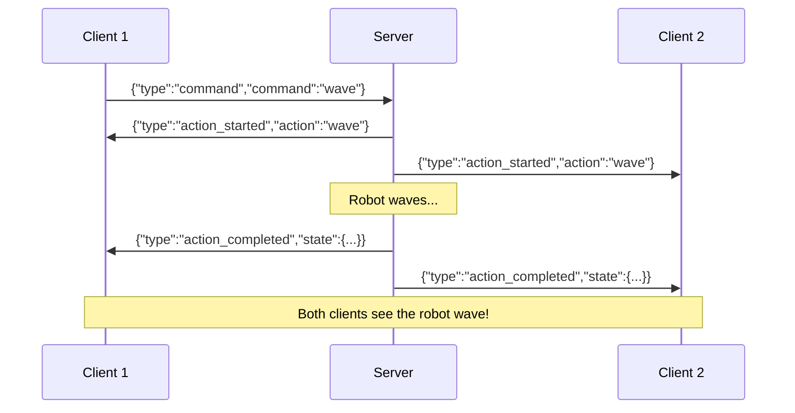

# Module 3: WebSocket Playground - Real-time Basics

Build a real-time robot controller using WebSockets. Control a virtual robot from your browser with instant feedback.

**Goal**: Understand bidirectional real-time communication between browser and server.

**Time**: 2 hours

**Prerequisites**: Node.js 18+

---

## What You will Learn

1. What are WebSockets and why use them
2. The WebSocket handshake and lifecycle
3. Sending and receiving messages
4. Broadcasting to multiple clients
5. Building a real-time control interface

---

## Quick Start

```bash
cd server
pnpm install
pnpm start

# Open http://localhost:8080 in your browser
```

Use the on-screen buttons or keyboard (WASD/arrows) to control the robot!

---

## Part 1: Understanding WebSockets

### HTTP vs WebSocket

**HTTP** (Traditional Web):

```
Browser ──request──> Server
Browser <──response── Server
(connection closed)
```

Each request opens a new connection, gets a response, then closes. Good for loading pages, not for real-time.

**WebSocket** (Real-time):

```
Browser ════════════════════════ Server
         (persistent connection)
         ◄────── messages ──────►
```

One connection stays open. Both sides can send messages anytime. Perfect for games, chat, and robot control!

### Why WebSockets for Robots?

| Feature       | HTTP Polling             | WebSocket            |
| ------------- | ------------------------ | -------------------- |
| Latency       | 100-1000ms               | 1-10ms               |
| Server Load   | High (constant requests) | Low (one connection) |
| Real-time     | Simulated                | True                 |
| Bidirectional | Request-only             | Both ways            |

### WebSocket Lifecycle



---

## Part 2: The Server (Node.js + ws)

### Setting Up

```typescript
import { WebSocketServer } from "ws";

// Create WebSocket server on port 8080
const wss = new WebSocketServer({ port: 8080 });

console.log("Server running on ws://localhost:8080");
```

### Handling Connections

```typescript
// Track all connected clients
const clients = new Set<WebSocket>();

wss.on("connection", (ws) => {
  // New client connected
  clients.add(ws);
  console.log(`Client connected (${clients.size} total)`);

  // Handle disconnect
  ws.on("close", () => {
    clients.delete(ws);
    console.log(`Client disconnected (${clients.size} remaining)`);
  });
});
```

### Receiving Messages

```typescript
ws.on("message", (data) => {
  // Parse JSON message
  const message = JSON.parse(data.toString());

  console.log("Received:", message);

  // Handle different message types
  switch (message.type) {
    case "command":
      executeCommand(message.command);
      break;
    case "ping":
      ws.send(JSON.stringify({ type: "pong" }));
      break;
  }
});
```

### Sending Messages

```typescript
// Send to one client
ws.send(
  JSON.stringify({
    type: "state",
    state: robotState,
  }),
);

// Broadcast to ALL clients
function broadcast(message) {
  const data = JSON.stringify(message);
  clients.forEach((client) => {
    if (client.readyState === WebSocket.OPEN) {
      client.send(data);
    }
  });
}
```

### Complete Server Flow



---

## Part 3: The Client (Browser JavaScript)

### Creating a Connection

```javascript
// Connect to server
const ws = new WebSocket("ws://localhost:8080");

// Connection opened
ws.onopen = () => {
  console.log("Connected!");
};

// Connection closed
ws.onclose = () => {
  console.log("Disconnected");
};

// Connection error
ws.onerror = (error) => {
  console.error("Error:", error);
};
```

### Sending Messages

```javascript
function sendCommand(command) {
  // Check connection is open
  if (ws.readyState !== WebSocket.OPEN) {
    console.log("Not connected!");
    return;
  }

  // Send JSON message
  ws.send(
    JSON.stringify({
      type: "command",
      command: command,
    }),
  );
}

// Usage
sendCommand("wave");
sendCommand("forward");
```

### Receiving Messages

```javascript
ws.onmessage = (event) => {
  // Parse the JSON message
  const message = JSON.parse(event.data);

  // Handle based on type
  switch (message.type) {
    case "state":
      updateRobotDisplay(message.state);
      break;

    case "action_started":
      console.log(`Starting: ${message.action}`);
      break;

    case "action_completed":
      console.log(`Completed: ${message.action}`);
      break;
  }
};
```

### Auto-Reconnect Pattern

```javascript
let reconnectInterval = null;

function connect() {
  ws = new WebSocket("ws://localhost:8080");

  ws.onopen = () => {
    // Clear reconnect timer on success
    if (reconnectInterval) {
      clearInterval(reconnectInterval);
      reconnectInterval = null;
    }
  };

  ws.onclose = () => {
    // Try to reconnect every 3 seconds
    if (!reconnectInterval) {
      reconnectInterval = setInterval(() => {
        console.log("Reconnecting...");
        connect();
      }, 3000);
    }
  };
}

connect();
```

---

## Part 4: Message Protocol

### Our Message Format

All messages are JSON objects with a `type` field:

**Client → Server:**

```typescript
interface ClientMessage {
  type: "command" | "ping";
  command?: string; // e.g., "forward", "sit", "wave"
}
```

**Server → Client:**

```typescript
interface ServerMessage {
  type: "welcome" | "state" | "action_started" | "action_completed" | "pong";
  state?: RobotState;
  action?: string;
  message?: string;
  clientCount?: number;
}
```

### Robot State

```typescript
interface RobotState {
  x: number; // 0-100 (percentage)
  y: number; // 0-100 (percentage)
  rotation: number; // 0-360 degrees
  posture: "standing" | "sitting" | "lying";
  isMoving: boolean;
  currentAction: string | null;
  mood: "happy" | "neutral" | "sleepy";
}
```

### Message Flow Example



---

## Part 5: Available Commands

| Command    | Description     | Duration |
| ---------- | --------------- | -------- |
| `forward`  | Move forward    | 500ms    |
| `backward` | Move backward   | 500ms    |
| `left`     | Turn left 15°   | 300ms    |
| `right`    | Turn right 15°  | 300ms    |
| `sit`      | Sit down        | 1000ms   |
| `stand`    | Stand up        | 1000ms   |
| `lie`      | Lie down        | 1500ms   |
| `wave`     | Wave hello      | 2000ms   |
| `sleep`    | Go to sleep     | 2000ms   |
| `wake`     | Wake up         | 1000ms   |
| `reset`    | Reset to center | 500ms    |

### Keyboard Controls

| Key   | Action     |
| ----- | ---------- |
| W / ↑ | Forward    |
| S / ↓ | Backward   |
| A / ← | Turn left  |
| D / → | Turn right |
| Space | Wave       |

---

## Part 6: Architecture

### System Overview

```
┌─────────────────────────────────────────────────────────────┐
│                        BROWSER                              │
│  ┌─────────────────┐       ┌─────────────────┐              │
│  │  Control Panel  │       │ Virtual Robot   │              │
│  │  [Buttons/Keys] │       │ [CSS Animation] │              │
│  └────────┬────────┘       └────────▲────────┘              │
│           │                         │                       │
│           ▼                         │                       │
│  ┌─────────────────────────────────────────────┐            │
│  │            WebSocket Client                 │            │
│  │   const ws = new WebSocket("ws://...")      │            │
│  └────────────────────┬────────────────────────┘            │
└───────────────────────│─────────────────────────────────────┘
                        │
                   WebSocket
                   Connection
                        │
┌───────────────────────│─────────────────────────────────────┐
│                       ▼                      SERVER         │
│  ┌─────────────────────────────────────────────┐            │
│  │            WebSocket Server                 │            │
│  │   const wss = new WebSocketServer(...)      │            │
│  └────────────────────┬────────────────────────┘            │
│                       │                                     │
│           ┌───────────┴───────────┐                         │
│           ▼                       ▼                         │
│  ┌─────────────────┐     ┌─────────────────┐                │
│  │ Message Handler │     │   Robot State   │                │
│  │ (parse & route) │     │ (x, y, posture) │                │
│  └─────────────────┘     └─────────────────┘                │
└─────────────────────────────────────────────────────────────┘
```

### Data Flow



---

## Part 7: Code Walkthrough

### Server: Key Parts

**1. HTTP + WebSocket on same port:**

```typescript
import { createServer } from "http";
import { WebSocketServer } from "ws";

// HTTP server serves the HTML page
const httpServer = createServer((req, res) => {
  // Serve index.html
});

// WebSocket server attaches to HTTP server
const wss = new WebSocketServer({ server: httpServer });

// Both run on port 8080
httpServer.listen(8080);
```

**2. Command execution with delay:**

```typescript
async function executeCommand(command) {
  const cmd = COMMANDS[command];

  // Mark robot as busy
  robotState.isMoving = true;
  broadcast({ type: "action_started", action: command });

  // Wait for action duration
  await new Promise((r) => setTimeout(r, cmd.duration));

  // Apply state change
  cmd.handler();

  // Mark robot as ready
  robotState.isMoving = false;
  broadcast({ type: "action_completed", action: command });
}
```

**3. Broadcast to all clients:**

```typescript
function broadcast(message) {
  const data = JSON.stringify(message);
  clients.forEach((client) => {
    if (client.readyState === WebSocket.OPEN) {
      client.send(data);
    }
  });
}
```

### Client: Key Parts

**1. Connect and handle events:**

```javascript
const ws = new WebSocket("ws://localhost:8080");

ws.onopen = () => updateStatus(true);
ws.onclose = () => updateStatus(false);
ws.onmessage = (event) => handleMessage(JSON.parse(event.data));
```

**2. Send command on button click:**

```html
<button onclick="sendCommand('wave')">Wave</button>
```

```javascript
function sendCommand(command) {
  ws.send(JSON.stringify({ type: "command", command }));
}
```

**3. Update robot visualization:**

```javascript
function updateRobot(state) {
  const robot = document.getElementById("robot");

  // Position (CSS percentage)
  robot.style.left = `${state.x}%`;
  robot.style.top = `${state.y}%`;

  // Rotation (CSS transform)
  robot.style.transform = `translate(-50%, -50%) rotate(${state.rotation}deg)`;

  // Posture (CSS classes)
  robot.className = `robot ${state.posture} ${state.mood}`;
}
```

---

## Part 8: Multi-Client Support

Open multiple browser tabs to see multi-client features:

1. **All clients see the same robot** - State is shared
2. **Client count updates** - See "(2 clients)" in status
3. **Actions are synchronized** - All clients see movements



---

## Project Structure

```
R3/
├── README.md           # This file
├── server/
│   ├── package.json
│   ├── tsconfig.json
│   └── src/
│       └── server.ts   # WebSocket + HTTP server
└── public/
    └── index.html      # Control page + virtual robot
```

---

## Exercises

### Exercise 1: Add a Chat Feature

Allow clients to send text messages to each other:

```javascript
// Client sends
ws.send(
  JSON.stringify({
    type: "chat",
    message: "Hello everyone!",
  }),
);

// Server broadcasts
broadcast({
  type: "chat",
  sender: clientId,
  message: "Hello everyone!",
});
```

### Exercise 2: Command Queue

Instead of ignoring commands while busy, queue them:

```typescript
const commandQueue: string[] = [];

function enqueueCommand(command) {
  commandQueue.push(command);
  processQueue();
}

async function processQueue() {
  if (robotState.isMoving || commandQueue.length === 0) return;

  const command = commandQueue.shift();
  await executeCommand(command);
  processQueue(); // Process next
}
```

### Exercise 3: Binary Messages

Send movement data as binary for efficiency:

```javascript
// Client: Send as ArrayBuffer
const buffer = new ArrayBuffer(4);
const view = new DataView(buffer);
view.setUint8(0, 1); // command type
view.setInt8(1, dx); // x movement
view.setInt8(2, dy); // y movement
view.setInt8(3, dr); // rotation
ws.send(buffer);

// Server: Parse binary
ws.on("message", (data, isBinary) => {
  if (isBinary) {
    const view = new DataView(data.buffer);
    // Parse bytes...
  }
});
```

---

## Common Issues

### "Connection refused"

- Make sure the server is running: `pnpm start`
- Check you are using the right port (8080)

### "WebSocket is not defined"

You are running client code in Node.js. WebSocket is browser-only.
For Node.js clients, use the `ws` package:

```javascript
import { WebSocket } from "ws";
```

### Messages not sending

Check `readyState` before sending:

```javascript
if (ws.readyState === WebSocket.OPEN) {
  ws.send(data);
}
```

### Robot does not move

- Check console for errors
- Verify message format is correct JSON
- Make sure robot is not already executing a command

---

## Key Takeaways

1. **WebSockets enable real-time** - One persistent connection, instant messages
2. **Both sides can send** - True bidirectional communication
3. **JSON is convenient** - Easy to parse, debug, and extend
4. **Broadcast for shared state** - All clients stay synchronized
5. **Handle disconnections** - Auto-reconnect for robustness

---

## Next Steps

Now that you understand real-time communication, you are ready for:

- **Module 4**: Combine blockchain queue + serial robot control
- **Module 5**: Add WebSocket to control a real robot (Module 1 + 3)
- **Module 6**: Add tunneling for internet access

---

## Resources

- [MDN WebSocket Guide](https://developer.mozilla.org/en-US/docs/Web/API/WebSockets_API)
- [ws Library Documentation](https://github.com/websockets/ws)
- [WebSocket Protocol (RFC 6455)](https://tools.ietf.org/html/rfc6455)
