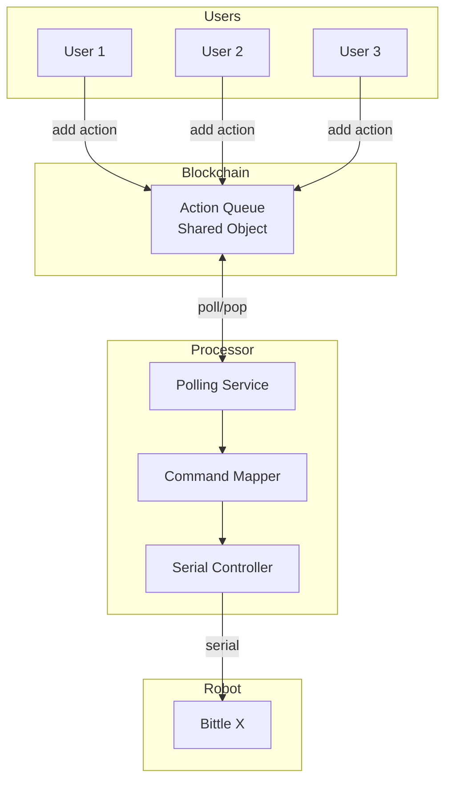
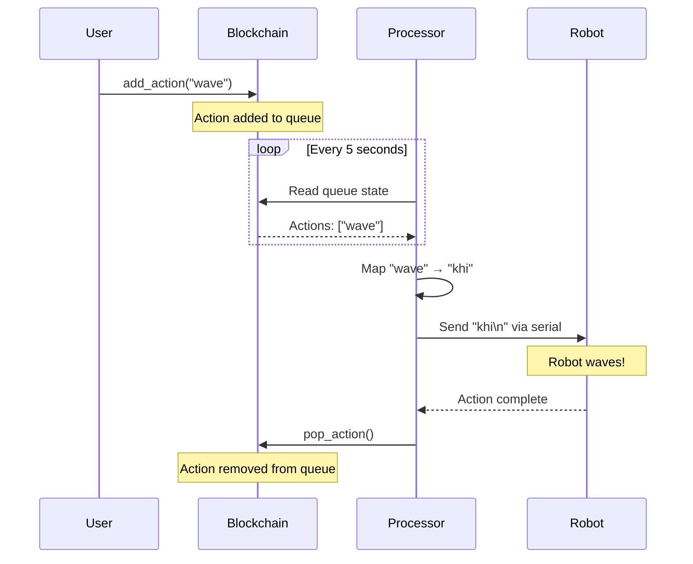

# Module 4: Blockchain Robot - First Integration

Connect the Sui blockchain to a physical Petoi Bittle robot. Watch as on-chain transactions make a real robot move!

**Goal**: Experience the "aha moment" - blockchain controlling the physical world.

**Time**: 2-3 hours

**Prerequisites**:

- Completed Module 1 (Serial Basics) and Module 2 (Blockchain Basics)
- Petoi Bittle X robot connected via USB
- Deployed action queue contract from Module 2

---

## What You Will Learn

1. How to bridge digital (blockchain) and physical (robot) worlds
2. Polling architecture for blockchain state changes
3. Mapping on-chain actions to physical commands
4. Building a reliable processor service

---

## The Big Picture

```
┌─────────────────────────────────────────────────────────────────────┐
│                         THE FLOW                                    │
│                                                                     │
│   User                  Blockchain                Processor         │
│    │                        │                        │              │
│    │  1. Add "wave"         │                        │              │
│    │───────────────────────>│                        │              │
│    │                        │                        │              │
│    │                        │  2. Poll every 5s      │              │
│    │                        │<───────────────────────│              │
│    │                        │                        │              │
│    │                        │  3. Return action      │              │
│    │                        │───────────────────────>│              │
│    │                        │                        │              │
│    │                        │                        │  4. Send to  │
│    │                        │                        │     robot    │
│    │                        │                        │      │       │
│    │                        │                        │      ▼       │
│    │                        │                        │   ┌──────┐   │
│    │                        │                        │   │Bittle│   │
│    │                        │                        │   │ waves│   │
│    │                        │                        │   └──────┘   │
│    │                        │                        │              │
│    │                        │  5. Pop action         │              │
│    │                        │<───────────────────────│              │
│                                                                     │
└─────────────────────────────────────────────────────────────────────┘
```

---

## Quick Start

```bash
# 1. Configure
cd processor
cp .env.example .env
# Edit .env with your PACKAGE_ADDRESS, QUEUE_ID, ADMIN_PHRASE, and SERIAL_PORT

# 2. Install dependencies
pnpm install

# 3. Test connections
pnpm test-blockchain  # Test blockchain connection
pnpm test-serial      # Test robot connection

# 4. Run the processor
pnpm start

# 5. In another terminal, add actions to the queue (from Module 2)
cd ../Module2\ -\ Blockchain\ Fundamentals/client
pnpm add-action wave
pnpm add-action sit
pnpm add-action walk_forward
```

Watch your robot execute the actions in order!

---

## Part 1: Architecture

### System Components



### Data Flow



---

## Part 2: The Processor

### How It Works

The processor is a simple loop:

```typescript
while (true) {
  // 1. Read queue from blockchain
  const state = await readQueue();

  if (state.actions.length > 0) {
    // 2. Get next action
    const action = state.actions[0];

    // 3. Map to robot command
    const command = getCommand(action.name);

    // 4. Execute on robot
    await sendCommand(command);

    // 5. Remove from blockchain queue
    await popAction();
  }

  // 6. Wait before next poll
  await sleep(POLL_INTERVAL_MS);
}
```

### Why Polling?

Polling is the simplest approach for blockchain → physical world:

| Approach      | Complexity | Latency | Reliability |
| ------------- | ---------- | ------- | ----------- |
| Polling       | Low        | 5-10s   | High        |
| Event indexer | Medium     | <1s     | High        |

For learning purposes, polling is ideal. Production systems might use event subscriptions.

---

## Part 3: Command Mapping

### The Bridge Between Worlds

```
┌─────────────────────────────────────────────────────────────┐
│                    COMMAND MAPPING                          │
│                                                             │
│   Blockchain Action  ──────────────>  Robot Command         │
│                                                             │
│   "wave"             ──────────────>  "khi"                 │
│   "sit"              ──────────────>  "ksit"                │
│   "walk_forward"     ──────────────>  "kwkF"                │
│   "jump"             ──────────────>  "kjmp"                │
│   "push_up"          ──────────────>  "kpu"                 │
│                                                             │
└─────────────────────────────────────────────────────────────┘
```

### Supported Actions

| Action Name     | Robot Command | Description           | Duration |
| --------------- | ------------- | --------------------- | -------- |
| `sit`           | `ksit`        | Sit down              | 2s       |
| `stand`         | `kup`         | Stand up              | 2s       |
| `balance`       | `kbalance`    | Balance on all fours  | 2s       |
| `rest`          | `krest`       | Lie down              | 3s       |
| `wave`          | `khi`         | Wave hello            | 3s       |
| `walk_forward`  | `kwkF`        | Walk forward          | 4s       |
| `walk_backward` | `kbk`         | Walk backward         | 4s       |
| `walk_left`     | `kwkL`        | Walk left             | 3s       |
| `walk_right`    | `kwkR`        | Walk right            | 3s       |
| `jump`          | `kjmp`        | Jump                  | 2s       |
| `push_up`       | `kpu`         | Do a push-up          | 5s       |
| `play_dead`     | `kpd`         | Play dead             | 3s       |
| `trot_forward`  | `ktrF`        | Trot forward (faster) | 3s       |

---

## Part 4: Configuration

### Environment Variables

```bash
# .env file

# Blockchain
NETWORK=testnet
PACKAGE_ADDRESS=0x...        # From Module 2 deployment
QUEUE_ID=0x...               # From Module 2 create-queue
ADMIN_PHRASE="twelve words"  # Must be queue admin

# Robot
SERIAL_PORT=/dev/ttyACM0     # Your robot's serial port
BAUD_RATE=115200             # Bittle uses 115200

# Processor
POLL_INTERVAL_MS=5000        # Check blockchain every 5s
ACTION_DELAY_MS=1000         # Wait between actions
DEBUG=false                  # Enable verbose logging
```

### Finding Your Serial Port

Use the detector from Module 1:

```bash
python3 ../Module1\ -\ Minimal\ Serial\ Control/detect-device.py
```

Or manually:

- **macOS**: `ls /dev/cu.usb*`
- **Linux**: `ls /dev/ttyACM* /dev/ttyUSB*`

---

## Part 5: Running the System

### Step 1: Start the Processor

```bash
cd Module4\ -\ First\ Integration
pnpm start
```

You should see:

```
==================================================
BLOCKCHAIN ROBOT PROCESSOR
==================================================

Configuration:
  Network: testnet
  Package: 0x1234567...
  Queue: 0x89abcde...
  Admin: 0xfedcba9...
  Serial Port: /dev/cu.usbmodem14101
  Baud Rate: 115200
  Poll Interval: 5000ms

Connecting to robot on /dev/cu.usbmodem14101...
Robot connected!

Queue state:
  Pending actions: 0
  Total added: 5
  Total processed: 5

Starting processor loop...
Polling every 5 seconds
Press Ctrl+C to stop
```

### Step 2: Add Actions from Another Terminal

Using Module 2's client:

```bash
cd Module2\ -\ Blockchain\ Fundamentals/client
pnpm add-action wave
pnpm add-action sit
pnpm add-action walk_forward
```

### Step 3: Watch the Magic!

In the processor terminal:

```
Processing action: "wave"
  From: 0x12345678...
  Queue depth: 3
  Executing: khi (Wave hello)
  Done! (3000ms)
  Marking as processed on blockchain...

Processing action: "sit"
  From: 0x12345678...
  Queue depth: 2
  Executing: ksit (Sit down)
  Done! (2000ms)
  Marking as processed on blockchain...

Processing action: "walk_forward"
  From: 0x12345678...
  Queue depth: 1
  Executing: kwkF (Walk forward)
  Done! (4000ms)
  Marking as processed on blockchain...
```

Your robot physically executes each action in order!

---

## Part 6: Code Walkthrough

### Main Processor Loop (`processor.ts`)

```typescript
async function processNextAction(): Promise<boolean> {
  // 1. Read queue from blockchain
  const state = await readQueue();

  if (state.actions.length === 0) {
    return false; // Nothing to do
  }

  // 2. Get next action
  const action = state.actions[0];

  // 3. Map to robot command
  const command = getCommand(action.name);

  if (!command) {
    // Unknown action - skip it
    await popAction();
    return true;
  }

  // 4. Execute on robot
  if (isConnected()) {
    await sendCommand(command);
  }

  // 5. Pop from blockchain
  await popAction();

  return true;
}
```

### Serial Communication (`serial.ts`)

```typescript
export async function sendCommand(command: BittleCommand): Promise<void> {
  // Send command code with newline
  port.write(command.code + "\n");

  // Wait for action to complete
  await new Promise((r) => setTimeout(r, command.duration));
}
```

### Blockchain Reading (`blockchain.ts`)

```typescript
export async function readQueue(): Promise<QueueState> {
  const response = await suiClient.getObject({
    id: QUEUE_ID,
    options: { showContent: true },
  });

  // Parse the Move struct fields
  const fields = response.data.content.fields;

  return {
    actions: fields.actions,
    totalAdded: fields.total_actions_added,
    totalProcessed: fields.total_actions_processed,
  };
}
```

---

## Part 7: Testing

### Test Serial Only

Verify robot connection without blockchain:

```bash
pnpm test-serial
```

```
=== Serial Connection Test ===

Port: /dev/cu.usbmodem14101
Baud: 115200

Connected! Running test sequence...

> balance: Balance on all fours
  Done!

> sit: Sit down
  Done!

> wave: Wave hello
  Done!

Test complete!
```

### Test Blockchain Only

Verify blockchain connection without robot:

```bash
pnpm test-blockchain
```

```
=== Blockchain Connection Test ===

Package: 0x1234567890abcdef...
Queue: 0x89abcdef01234567...
Admin: 0xfedcba9876543210...

1. Reading queue state...
   Pending: 0
   Total added: 5
   Total processed: 5
   Success!

2. Adding test action...
   Transaction: ABC123...
   Success!

3. Reading updated queue...
   Pending: 1
   Actions: wave
   Success!

4. Popping action...
   Popped: "wave"
   Success!

=== All tests passed! ===
```

---

## Part 8: Simulation Mode

No robot? No problem! The processor runs in simulation mode:

```
Warning: Robot not connected!
Running in simulation mode (commands will be logged but not executed)
Connect your robot and restart to control it.

Processing action: "wave"
  From: 0x12345678...
  Executing: khi (Wave hello)
  [SIMULATED] Robot not connected
  Done! (3000ms)
  Marking as processed on blockchain...
```

This lets you test the full blockchain flow without hardware.

---

## Project Structure

```
R4/
├── README.md                  # This file
└── processor/
    ├── package.json
    ├── tsconfig.json
    ├── .env.example
    └── src/
        ├── config.ts          # Load environment variables
        ├── commands.ts        # Action → Command mapping
        ├── serial.ts          # Robot serial communication
        ├── blockchain.ts      # Sui blockchain interaction
        ├── processor.ts       # Main processing loop
        ├── test-serial.ts     # Test robot connection
        └── test-blockchain.ts # Test blockchain connection
```

---

## Exercises

### Exercise 1: Add New Actions

Add support for more Bittle commands in `commands.ts`:

```typescript
// Add these to ACTION_TO_COMMAND
back_flip: {
  code: "kbf",
  duration: 3500,
  description: "Do a backflip",
},
moonwalk: {
  code: "kmw",
  duration: 4000,
  description: "Moonwalk",
},
```

### Exercise 2: Action Validation

Add validation before executing:

```typescript
// In processor.ts
if (action.name.includes("flip") && !robotIsStable()) {
  console.log("Skipping flip - robot not stable");
  await popAction();
  return;
}
```

### Exercise 3: Status Reporting

Add a status endpoint or log file:

```typescript
// Write status to file every poll
const status = {
  lastPoll: new Date().toISOString(),
  pendingActions: state.actions.length,
  actionsProcessed,
  robotConnected: isConnected(),
};
fs.writeFileSync("status.json", JSON.stringify(status, null, 2));
```

### Exercise 4: Multiple Robots

Support multiple robots with different queues:

```typescript
// Each robot has its own queue and serial port
const robots = [
  { queueId: "0x...", serialPort: "/dev/ttyACM0" },
  { queueId: "0x...", serialPort: "/dev/ttyACM1" },
];
```

---

## Troubleshooting

### "Robot not connected"

1. Check USB cable
2. Find correct port: `python3 detect-device.py`
3. Set `SERIAL_PORT` in `.env`
4. On Linux, add user to dialout group:
   ```bash
   sudo usermod -a -G dialout $USER
   ```

### "Error reading queue"

1. Verify `QUEUE_ID` is correct
2. Verify `PACKAGE_ADDRESS` is correct
3. Make sure contract is deployed on the right network

### "ENotAuthorized" when popping

Only the queue admin can pop actions. Make sure `ADMIN_PHRASE` matches the wallet that created the queue.

### Actions execute but robot does not move

1. Check robot is powered on
2. Verify baud rate is 115200
3. Wait for Bittle to boot (5-10 seconds after power on)
4. Try `pnpm test-serial` to verify connection

---

## Key Takeaways

1. **Polling is simple** - Easy to implement, reliable, good for learning
2. **Separation of concerns** - Blockchain, mapping, and serial are independent modules
3. **Simulation mode** - Test blockchain flow without hardware
4. **FIFO processing** - First action in, first action executed
5. **The magic** - A transaction on a global blockchain makes a physical robot move!

---

## Next Steps

Now that you have blockchain controlling a robot, you are ready for:

- **Module 5**: Add WebSocket for real-time browser control (Module 1 + 3)
- **Module 6**: Add tunneling for internet access
- **Module 7**: Secure the channel with authentication

---

## Resources

- [Module 1: Serial Basics](../Module1%20-%20Minimal%20Serial%20Control/README.md)
- [Module 2: Blockchain Fundamentals](../Module2%20-%20Blockchain%20Fundamentals/README.md)
- [Petoi Bittle Documentation](https://docs.petoi.com/)
- [Sui Developer Documentation](https://docs.sui.io/)
