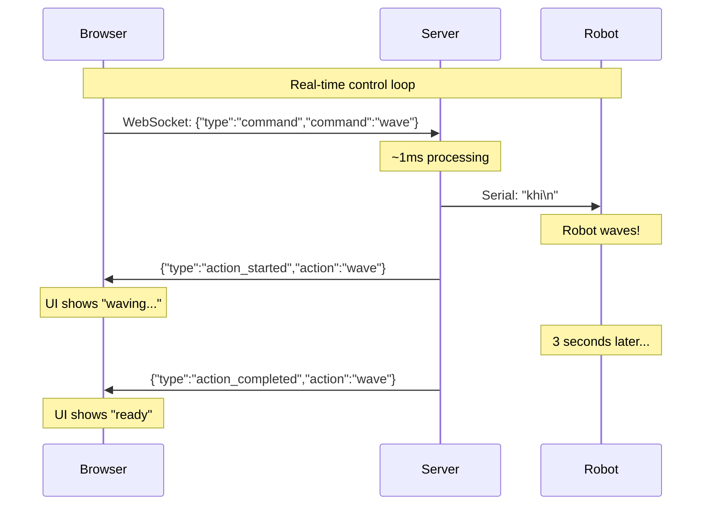
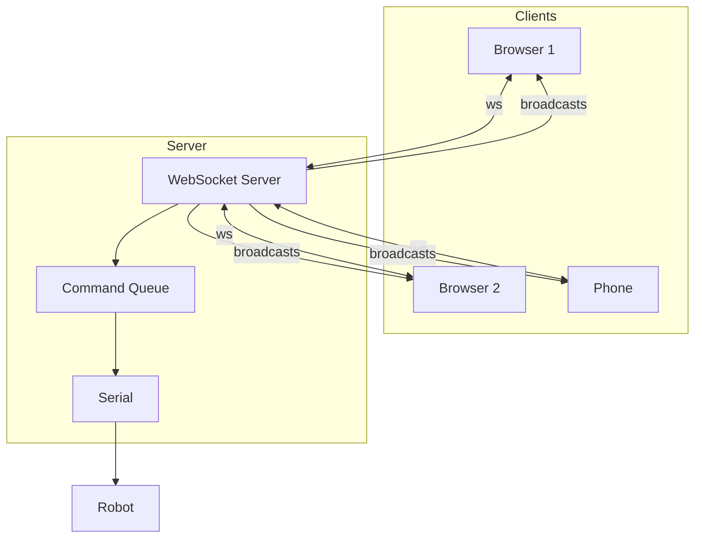

# Module R5: Live Control - WebSocket + Serial

Control your Petoi Bittle robot in real-time from a web browser. No blockchain delays - instant response!

**Goal**: Experience true real-time robot control over the local network.

**Time**: 1-2 hours

**Prerequisites**:

- Completed Module 1 (Serial Basics) and Module 3 (WebSocket Basics)
- Petoi Bittle X robot connected via USB
- Node.js 18+

---

## What You Will Learn

1. How to combine WebSocket and serial communication
2. Command queuing vs dropping strategies
3. Measuring and optimizing latency
4. Building responsive real-time controls
5. Multi-client synchronization with a physical device

---

## The Big Picture

```
┌─────────────────────────────────────────────────────────────────┐
│                    REAL-TIME CONTROL                            │
│                                                                 │
│   ┌──────────┐        ┌──────────────┐         ┌──────────┐     │
│   │ Browser  │◄──────►│    Server    │◄───────►│  Bittle  │     │
│   │(keyboard)│   WS   │   (Node.js)  │  Serial │  Robot   │     │
│   └──────────┘  ~10ms └──────────────┘  ~1ms   └──────────┘     │
│                                                                 │
│   Total latency: 10-50ms (feels instant!)                       │
└─────────────────────────────────────────────────────────────────┘
```

Compare to Module 4 (blockchain): 5000-10000ms latency
This module: 10-50ms latency - **100x faster!**

---

## Quick Start

```bash
# 1. Configure
cd server
cp .env.example .env
# Edit .env with your SERIAL_PORT

# 2. Install and run
pnpm install
pnpm start

# 3. Open browser
open http://localhost:8080
```

Use WASD keys or click buttons to control your robot instantly!

---

## Part 1: Architecture

### Data Flow



### System Components

```
┌─────────────────────────────────────────────────────────────────┐
│                         SERVER                                  │
│                                                                 │
│   ┌─────────────────┐     ┌─────────────────┐                   │
│   │   HTTP Server   │     │ WebSocket Server│                   │
│   │  (serves HTML)  │     │   (real-time)   │                   │
│   └────────┬────────┘     └────────┬────────┘                   │
│            │                       │                            │
│            └───────────┬───────────┘                            │
│                        │                                        │
│                        ▼                                        │
│            ┌─────────────────────┐                              │
│            │   Command Handler   │                              │
│            │  ┌───────────────┐  │                              │
│            │  │ Command Queue │  │                              │
│            │  └───────────────┘  │                              │
│            └──────────┬──────────┘                              │
│                       │                                         │
│                       ▼                                         │
│            ┌─────────────────────┐                              │
│            │  Serial Controller  │──────────► Robot             │
│            └─────────────────────┘                              │
│                                                                 │
└─────────────────────────────────────────────────────────────────┘
```

---

## Part 2: Command Handling Strategies

### Strategy 1: Queue Mode (Default)

Commands are queued and executed in order:

```
User clicks: wave, sit, jump

Queue: [wave] → [sit] → [jump]
                  │
                  └── Each executes after previous completes
```

**Pros**: All commands execute, predictable behavior
**Cons**: Delayed response if queue builds up

### Strategy 2: Drop Mode

Commands are dropped if robot is busy:

```
User clicks: wave (while robot is waving)

Result: "Robot busy" - command ignored
```

**Pros**: Immediate feedback, no queue buildup
**Cons**: Commands can be lost

### Configuration

```bash
# In .env
QUEUE_COMMANDS=true   # Queue mode (default)
QUEUE_COMMANDS=false  # Drop mode
MAX_QUEUE_SIZE=10     # Prevent unbounded queue
```

---

## Part 3: Latency Breakdown

### Where Time Goes

```
┌────────────────────────────────────────────────────────────────┐
│                      LATENCY BREAKDOWN                         │
├────────────────────────────────────────────────────────────────┤
│                                                                │
│   Browser → Server (WebSocket)         ~5-20ms                 │
│   Server processing                    ~1ms                    │
│   Server → Robot (Serial)              ~1ms                    │
│   Robot acknowledgment                 ~5ms                    │
│   Server → Browser (WebSocket)         ~5-20ms                 │
│   ─────────────────────────────────────────────                │
│   TOTAL                                ~15-50ms                │
│                                                                │
│   Human perception threshold: ~100ms                           │
│   Result: Feels instant!                                       │
│                                                                │
└────────────────────────────────────────────────────────────────┘
```

### Measuring Latency

The UI displays real-time latency using ping/pong:

```javascript
// Client sends ping
ws.send(JSON.stringify({ type: "ping" }));
lastPingTime = Date.now();

// Server responds
ws.send(JSON.stringify({ type: "pong" }));

// Client calculates
const latency = Date.now() - lastPingTime;
// Display: "Latency: 23ms"
```

### Latency Indicators

| Latency  | Color  | Experience       |
| -------- | ------ | ---------------- |
| < 50ms   | Green  | Excellent        |
| 50-150ms | Yellow | Good             |
| > 150ms  | Red    | Noticeable delay |

---

## Part 4: Keyboard Controls

### Default Key Mapping

| Key   | Action       | Description      |
| ----- | ------------ | ---------------- |
| W / ↑ | `forward`    | Walk forward     |
| S / ↓ | `backward`   | Walk backward    |
| A / ← | `left`       | Turn left        |
| D / → | `right`      | Turn right       |
| Space | `stop`       | Stop/Balance     |
| Q     | `trot_left`  | Quick turn left  |
| E     | `trot_right` | Quick turn right |
| 1     | `sit`        | Sit down         |
| 2     | `stand`      | Stand up         |
| 3     | `balance`    | Balance position |
| 4     | `wave`       | Wave hello       |

### Key Event Handling

```javascript
const keyMap = {
  w: "forward",
  arrowup: "forward",
  s: "backward",
  // ...
};

// Prevent key repeat (hold key = single command)
const pressedKeys = new Set();

document.addEventListener("keydown", (e) => {
  const key = e.key.toLowerCase();
  if (keyMap[key] && !pressedKeys.has(key)) {
    pressedKeys.add(key);
    sendCommand(keyMap[key]);
  }
});

document.addEventListener("keyup", (e) => {
  pressedKeys.delete(e.key.toLowerCase());
});
```

---

## Part 5: Multi-Client Support

Multiple browsers can connect and control the same robot:



### Synchronization

All clients receive:

- Connection status updates
- Action started/completed events
- Queue state changes
- Client count updates

```javascript
// Server broadcasts to all clients
function broadcast(message) {
  clients.forEach((client) => {
    if (client.readyState === WebSocket.OPEN) {
      client.send(JSON.stringify(message));
    }
  });
}

// Every client sees the same robot state
broadcast({
  type: "action_started",
  action: "wave",
  description: "Wave hello",
  duration: 3000,
});
```

---

## Part 6: Available Commands

### Movement Commands

| Command        | Serial Code | Duration | Description   |
| -------------- | ----------- | -------- | ------------- |
| `forward`      | `kwkF`      | 3000ms   | Walk forward  |
| `backward`     | `kbk`       | 3000ms   | Walk backward |
| `left`         | `kwkL`      | 2000ms   | Turn left     |
| `right`        | `kwkR`      | 2000ms   | Turn right    |
| `trot_forward` | `ktrF`      | 2000ms   | Trot forward  |
| `trot_left`    | `ktrL`      | 1500ms   | Trot left     |
| `trot_right`   | `ktrR`      | 1500ms   | Trot right    |

### Posture Commands

| Command   | Serial Code | Duration | Description |
| --------- | ----------- | -------- | ----------- |
| `sit`     | `ksit`      | 2000ms   | Sit down    |
| `stand`   | `kup`       | 2000ms   | Stand up    |
| `balance` | `kbalance`  | 2000ms   | Balance     |
| `rest`    | `krest`     | 3000ms   | Lie down    |

### Action Commands

| Command     | Serial Code | Duration | Description    |
| ----------- | ----------- | -------- | -------------- |
| `wave`      | `khi`       | 3000ms   | Wave hello     |
| `jump`      | `kjmp`      | 2000ms   | Jump           |
| `push_up`   | `kpu`       | 5000ms   | Push up        |
| `play_dead` | `kpd`       | 3000ms   | Play dead      |
| `stretch`   | `kstr`      | 3000ms   | Stretch        |
| `stop`      | `kbalance`  | 500ms    | Emergency stop |

---

## Part 7: Code Walkthrough

### Server: Handling Commands

```typescript
function handleCommand(commandName: string) {
  const command = COMMANDS[commandName];
  if (!command) {
    return { success: false, message: "Unknown command" };
  }

  if (QUEUE_COMMANDS) {
    // Queue mode: add to queue
    if (commandQueue.length < MAX_QUEUE_SIZE) {
      commandQueue.push(commandName);
      processQueue(); // Start processing
      return { success: true, message: "Queued" };
    }
    return { success: false, message: "Queue full" };
  } else {
    // Drop mode: reject if busy
    if (robotState.busy) {
      return { success: false, message: "Robot busy" };
    }
    executeCommand(commandName);
    return { success: true, message: "Executing" };
  }
}
```

### Server: Serial Communication

```typescript
async function sendToRobot(command: BittleCommand): Promise<void> {
  return new Promise((resolve, reject) => {
    // Send command to serial port
    serialPort.write(command.code + "\n", (err) => {
      if (err) return reject(err);

      // Wait for action duration
      setTimeout(resolve, command.duration);
    });
  });
}
```

### Client: Responsive UI

```javascript
function showCurrentAction(action, description, duration) {
  // Show action in UI
  document.getElementById("currentAction").classList.remove("idle");
  document.querySelector(".action-name").textContent = action;
  document.querySelector(".action-desc").textContent = description;

  // Animate progress bar
  currentActionStart = Date.now();
  currentActionDuration = duration;
  progressInterval = setInterval(updateProgress, 50);
}

function updateProgress() {
  const elapsed = Date.now() - currentActionStart;
  const percent = Math.min(100, (elapsed / currentActionDuration) * 100);
  document.getElementById("progressFill").style.width = percent + "%";
}
```

---

## Part 8: Simulation Mode

No robot connected? The server runs in simulation mode:

```
Warning: Robot not connected!
Running in simulation mode.

[Browser sends command]
> Simulating: wave (3000ms)
> Completed: wave
```

This lets you test the UI and WebSocket flow without hardware.

---

## Project Structure

```
R5/
├── README.md                # This file
├── server/
│   ├── package.json
│   ├── tsconfig.json
│   ├── .env.example
│   └── src/
│       └── server.ts        # WebSocket + Serial server
└── public/
    └── index.html           # Control interface
```

---

## Exercises

### Exercise 1: Continuous Movement

Hold a key for continuous movement:

```javascript
let moveInterval = null;

document.addEventListener("keydown", (e) => {
  if (e.key === "w" && !moveInterval) {
    moveInterval = setInterval(() => {
      sendCommand("step_forward");
    }, 500);
  }
});

document.addEventListener("keyup", (e) => {
  if (e.key === "w" && moveInterval) {
    clearInterval(moveInterval);
    moveInterval = null;
    sendCommand("stop");
  }
});
```

### Exercise 2: Speed Control

Add fast/slow modes:

```javascript
let speedMode = 'normal'; // 'slow', 'normal', 'fast'

function sendMovement(direction) {
  const commands = {
    slow: { forward: 'step_forward', ... },
    normal: { forward: 'forward', ... },
    fast: { forward: 'trot_forward', ... }
  };
  sendCommand(commands[speedMode][direction]);
}
```

### Exercise 3: Record and Playback

Record command sequences:

```javascript
const recording = [];
let isRecording = false;

function toggleRecording() {
  isRecording = !isRecording;
  if (!isRecording && recording.length > 0) {
    console.log("Recorded:", recording);
  }
}

function sendCommand(cmd) {
  if (isRecording) {
    recording.push({ cmd, time: Date.now() });
  }
  // ... send command
}

async function playback() {
  for (let i = 0; i < recording.length; i++) {
    sendCommand(recording[i].cmd);
    if (i < recording.length - 1) {
      await sleep(recording[i + 1].time - recording[i].time);
    }
  }
}
```

### Exercise 4: Mobile Controls

Add touch-friendly joystick:

```html
<div
  id="joystick"
  style="width: 150px; height: 150px; border-radius: 50%; background: #333;"
>
  <div
    id="knob"
    style="width: 50px; height: 50px; border-radius: 50%; background: #4a9eff;"
  ></div>
</div>
```

```javascript
joystick.addEventListener("touchmove", (e) => {
  const touch = e.touches[0];
  const rect = joystick.getBoundingClientRect();
  const x = (touch.clientX - rect.left - 75) / 75;
  const y = (touch.clientY - rect.top - 75) / 75;

  if (Math.abs(y) > 0.5) {
    sendCommand(y < 0 ? "forward" : "backward");
  }
  if (Math.abs(x) > 0.5) {
    sendCommand(x > 0 ? "right" : "left");
  }
});
```

---

## Troubleshooting

### "Robot not connected"

1. Check USB cable is connected
2. Find your port: `python3 ../Module1\ -\ Minimal\ Serial\ Control/detect-device.py`
3. Set `SERIAL_PORT` in `.env`

### High latency (>100ms)

1. Check WiFi connection (use Ethernet if possible)
2. Close other browser tabs
3. Check for CPU-intensive processes

### Commands feel slow

1. Reduce command durations in `COMMANDS` object
2. Use shorter commands like `step_forward` instead of `forward`
3. Switch to drop mode: `QUEUE_COMMANDS=false`

### Queue builds up

1. Reduce `MAX_QUEUE_SIZE`
2. Click "Clear" button
3. Use drop mode for more responsive control

---

## Comparison: Module 4 vs Module 5

| Aspect      | Module 4 (Blockchain)     | Module 5 (WebSocket) |
| ----------- | ------------------------- | -------------------- |
| Latency     | 5-10 seconds              | 10-50 ms             |
| Persistence | Forever on-chain          | None (RAM only)      |
| Multi-user  | Yes (via blockchain)      | Yes (via broadcast)  |
| Cost        | Gas fees                  | Free                 |
| Internet    | Required                  | Local network only   |
| Use case    | Async queue, auditability | Real-time control    |

Choose based on your needs:

- **Module 4**: When you need permanent record, global access, or tokenomics
- **Module 5**: When you need instant response and low latency

---

## Key Takeaways

1. **Real-time is possible** - WebSocket + Serial gives ~10-50ms latency
2. **Queue vs Drop** - Trade-off between reliability and responsiveness
3. **Multi-client works** - Broadcast keeps everyone synchronized
4. **Keyboard control** - Makes robots feel like video games
5. **Simulation mode** - Develop and test without hardware

---

## Next Steps

Now that you have real-time control, you are ready for:

- **Module 6**: Add tunneling for internet access (control from anywhere!)
- **Module 7**: Add authentication (secure your robot)
- **Module 8**: Combine blockchain + WebSocket (best of both worlds)

---

## Resources

- [Module 1: Serial Basics](../Module1%20-%20Minimal%20Serial%20Control/README.md)
- [Module 3: WebSocket Basics](../Module3%20-%20Real-time%20Basics/README.md)
- [ws Library Documentation](https://github.com/websockets/ws)
- [SerialPort Documentation](https://serialport.io/)
