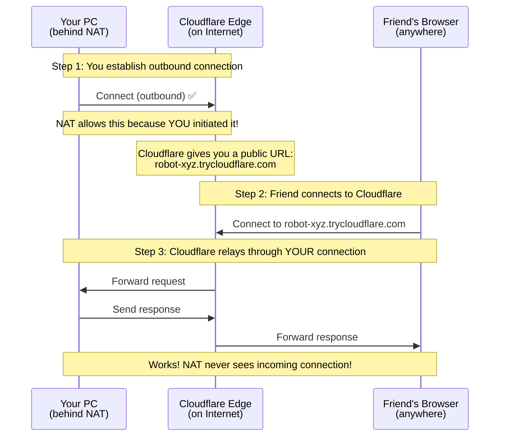
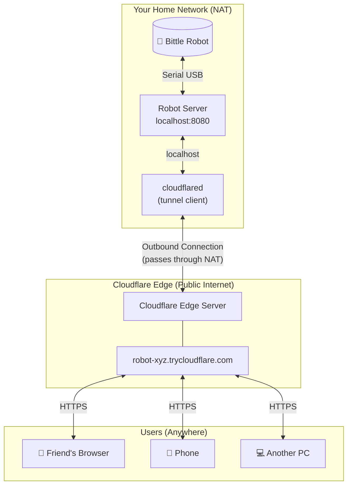

# Module 6: Open to the World - Tunneling 101

Control your robot from anywhere in the world! No static IP, no port forwarding, no router configuration needed.

**Goal**: Expose your local robot control server to the internet securely using Cloudflare Tunnel.

**Time**: 30 minutes

**Prerequisites**:

- Completed Module 5 (WebSocket + Serial server)
- Internet connection

---

## What You Will Learn

1. Why you cannot just "open a port" to the internet
2. What NAT is and why it exists
3. How tunneling solves the NAT problem
4. Using Cloudflare Tunnel for free, secure access
5. Security considerations for exposing local services

---

## The Problem: NAT and Private Networks

### Why Cannot People Just Connect to My Computer?

When you run a server on your laptop, it works great locally:

```
http://localhost:8080  ✅ Works!
```

But when a friend tries to connect from their house:

```
http://your-ip:8080  ❌ Connection refused!
```

**Why?** Because of NAT (Network Address Translation).

### What is NAT?

```
┌─────────────────────────────────────────────────────────────────────────────┐
│                           YOUR HOME NETWORK                                 │
│                                                                             │
│   ┌─────────────┐    ┌─────────────┐    ┌─────────────┐                     │
│   │  Your PC    │    │   Phone     │    │   Laptop    │                     │
│   │ 192.168.1.5 │    │ 192.168.1.6 │    │ 192.168.1.7 │                     │
│   └──────┬──────┘    └──────┬──────┘    └──────┬──────┘                     │
│          │                  │                  │                            │
│          └────────────┬─────┴──────────────────┘                            │
│                       │                                                     │
│              ┌────────┴────────┐                                            │
│              │     Router      │                                            │
│              │ (NAT Device)    │                                            │
│              │                 │                                            │
│              │ Private: 192.168.1.1                                         │
│              │ Public:  73.45.123.89  ◄── Your ISP gives you ONE IP         │
│              └────────┬────────┘                                            │
└───────────────────────┼─────────────────────────────────────────────────────┘
                        │
                  ┌─────┴────┐
                  │ Internet │
                  └──────────┘
```

**Key insight**:

- Your devices have **private IPs** (192.168.x.x) - not reachable from internet
- Your home has ONE **public IP** (73.45.x.x) - shared by all devices
- The router uses NAT to share that one public IP among all your devices

### The NAT Translation Table

When you browse the web, NAT works **outbound**:

```
┌─────────────────────────────────────────────────────────────────────────────┐
│                           NAT IN ACTION                                     │
│                                                                             │
│   Your PC wants to visit google.com:                                        │
│                                                                             │
│   ┌──────────────────────────────────────────────────────────────────────┐  │
│   │                        ROUTER NAT TABLE                              │  │
│   ├────────────────────┬─────────────────────┬───────────────────────────┤  │
│   │ Internal           │ External             │ Destination              │  │
│   ├────────────────────┼─────────────────────┼───────────────────────────┤  │
│   │ 192.168.1.5:54321  │ 73.45.123.89:54321  │ 142.250.80.46:443         │  │
│   │                    │                      │ (google.com)             │  │
│   └────────────────────┴─────────────────────┴───────────────────────────┘  │
│                                                                             │
│   1. Your PC sends request FROM 192.168.1.5:54321                           │
│   2. Router changes it TO 73.45.123.89:54321 (your public IP)               │
│   3. Google responds TO 73.45.123.89:54321                                  │
│   4. Router sees the table entry, forwards TO 192.168.1.5:54321             │
│                                                                             │
│   ✅ Works because YOUR PC initiated the connection!                        │
└─────────────────────────────────────────────────────────────────────────────┘
```

### Why Inbound Connections Fail

When someone from the internet tries to connect TO you:

```
┌─────────────────────────────────────────────────────────────────────────────┐
│                    INBOUND CONNECTION ATTEMPT                               │
│                                                                             │
│   Friend tries to connect to your robot server:                             │
│                                                                             │
│   Friend's PC ──────► 73.45.123.89:8080 ──────► ???                         │
│                                                                             │
│   ┌──────────────────────────────────────────────────────────────────────┐  │
│   │                        ROUTER NAT TABLE                              │  │
│   ├────────────────────┬─────────────────────┬───────────────────────────┤  │
│   │ Internal           │ External            │ Destination               │  │
│   ├────────────────────┼─────────────────────┼───────────────────────────┤  │
│   │ (empty)            │ (empty)             │ (empty)                   │  │
│   └────────────────────┴─────────────────────┴───────────────────────────┘  │
│                                                                             │
│   Router: "Someone wants to connect to port 8080..."                        │
│   Router: "But which internal device? I have no entry for this!"            │
│   Router: "DROP the packet!"                                                │
│                                                                             │
│   ❌ Connection refused - no NAT entry exists!                              │
└─────────────────────────────────────────────────────────────────────────────┘
```

**The problem**: NAT only works for connections YOU initiate. There is no entry in the table for incoming connections.

---

## Traditional Solutions (And Why They are Hard)

### Option 1: Port Forwarding

```
Router Settings:
  Forward port 8080 → 192.168.1.5:8080
```

**Problems**:

- Need router admin access
- Many ISPs block incoming ports
- Router UI is confusing
- Must configure firewall too
- IP might change (dynamic IP)
- Exposes your real IP address

### Option 2: Static IP from ISP

**Problems**:

- Costs extra money
- Still need port forwarding
- Exposes your real IP

### Option 3: Dynamic DNS (DDNS)

**Problems**:

- Still need port forwarding
- Just solves the changing IP problem
- Complex setup

---

## The Modern Solution: Tunneling

### How Tunneling Works

The key insight: **YOU can connect OUT, so let's use that!**



### The Tunnel Architecture

```
┌─────────────────────────────────────────────────────────────────────────────┐
│                         CLOUDFLARE TUNNEL                                   │
│                                                                             │
│  YOUR HOME                           INTERNET                               │
│  ─────────                           ────────                               │
│                                                                             │
│  ┌──────────┐    ┌──────────┐       ┌─────────────────────┐                 │
│  │  Robot   │───►│  Server  │       │  Cloudflare Edge    │                 │
│  │ (Bittle) │    │ :8080    │       │                     │                 │
│  └──────────┘    └────┬─────┘       │  ┌───────────────┐  │    ┌──────────┐ │
│                       │             │  │ Your Tunnel   │  │◄───│  Friend  │ │
│                       │             │  │               │  │    │ Browser  │ │
│                  ┌────┴──────┐      │  │ robot-xyz     │  │    └──────────┘ │
│                  │cloudflared│──────►  │ .trycloudflare│  │                 │
│                  │ (tunnel   │  YOU │  │ .com          │  │    ┌──────────┐ │
│                  │  client)  │ CONNECT └───────────────┘  │◄───│  Phone   │ │
│                  └───────────┘ OUT! │                     │    │ (mobile) │ │
│                       │             └─────────────────────┘    └──────────┘ │
│                       │                                                     │
│                  ┌────┴────┐                                                │
│                  │ Router  │  NAT does not block because                    │
│                  │  (NAT)  │  YOU initiated the connection!                 │
│                  └────┬────┘                                                │
│                       │                                                     │
└───────────────────────┼─────────────────────────────────────────────────────┘
                        │
                   ┌────┴─────┐
                   │ Internet │
                   └──────────┘
```

### Why This Is Brilliant

1. **No router config** - You connect OUT (always allowed)
2. **No port forwarding** - Cloudflare handles incoming connections
3. **No static IP** - Cloudflare gives you a stable URL
4. **Hidden IP** - Your real IP is never exposed
5. **Encrypted** - All traffic goes through HTTPS
6. **Free** - Cloudflare offers this for free!

---

## Quick Start

### Step 1: Install cloudflared

```bash
cd Module6\ -\ Tunneling\ 101/scripts

# Run the installer
./install-cloudflared.sh
```

Or install manually:

**macOS (Homebrew)**:

```bash
brew install cloudflared
```

**Ubuntu/Debian**:

```bash
curl -L --output cloudflared.deb https://github.com/cloudflare/cloudflared/releases/latest/download/cloudflared-linux-amd64.deb
sudo dpkg -i cloudflared.deb
```

**Verify installation**:

```bash
cloudflared --version
# cloudflared version 202x.x.x
```

### Step 2: Start Module 5 Server

In one terminal:

```bash
cd ../Module5\ -\ WebSocket\ +\ Serial/server
pnpm install
pnpm start
```

You should see:

```
REAL-TIME ROBOT CONTROL SERVER
==============================
Server running at:
  http://localhost:8080
  ws://localhost:8080
```

### Step 3: Start the Tunnel

In another terminal:

```bash
cd Module6\ -\ Tunneling\ 101/scripts
./start-tunnel.sh
```

You will see output like:

```
========================================
CLOUDFLARE TUNNEL
========================================

Your quick Tunnel has been created! Visit it at:
  https://robot-funny-word-1234.trycloudflare.com
```

### Step 4: Share the URL!

Copy that URL and send it to anyone. They can now control your robot from anywhere in the world!

---

## One Command: Start Everything

For convenience, start both server and tunnel together:

```bash
cd Module6\ -\ Tunneling\ 101/scripts
./start-all.sh
```

This starts:

1. Module 5 robot server (port 8080)
2. Cloudflare tunnel pointing to it

Press `Ctrl+C` to stop both.

---

## How Cloudflare Quick Tunnels Work

### Quick Tunnel (No Account)

What we are using - zero configuration:

```bash
cloudflared tunnel --url http://localhost:8080
```

This creates a **temporary** tunnel:

- Random URL like `word-word-1234.trycloudflare.com`
- **Lasts as long as cloudflared runs**
- New URL each time you start
- Perfect for testing and demos
- No account needed!

### Named Tunnel (With Account)

For permanent URLs, you need a Cloudflare account:

```bash
# One-time setup
cloudflared tunnel login
cloudflared tunnel create my-robot
cloudflared tunnel route dns my-robot robot.yourdomain.com

# Run tunnel
cloudflared tunnel run my-robot
```

Benefits:

- Permanent URL (your own domain)
- Survives restarts
- Access controls
- Analytics

---

## Data Flow: Complete Picture



### Request Journey

```
┌─────────────────────────────────────────────────────────────────────────────┐
│                    COMPLETE REQUEST JOURNEY                                 │
│                                                                             │
│   Friend clicks "Wave" button in browser:                                   │
│                                                                             │
│   1. Browser → Cloudflare (HTTPS)                                           │
│      POST https://robot-xyz.trycloudflare.com                               │
│      Body: {"type":"command","command":"wave"}                              │
│                                                                             │
│   2. Cloudflare → Your cloudflared (through tunnel)                         │
│      Forwards the request through the established connection                │
│                                                                             │
│   3. cloudflared → localhost:8080                                           │
│      Forwards to your local server                                          │
│                                                                             │
│   4. Server → Robot (Serial)                                                │
│      Sends: "khi\n" (wave command)                                          │
│                                                                             │
│   5. Response travels back                                                  │
│      Robot → Server → cloudflared → Cloudflare → Browser                    │
│                                                                             │
│   Total latency: ~100-300ms (internet round trip)                           │
│   Compared to local: ~10-50ms                                               │
│   Still feels responsive!                                                   │
└─────────────────────────────────────────────────────────────────────────────┘
```

---

## WebSocket Over Tunnel

Module 5 uses WebSocket for real-time control. Good news: **Cloudflare Tunnel supports WebSocket!**

```
┌─────────────────────────────────────────────────────────────────────────────┐
│                    WEBSOCKET THROUGH TUNNEL                                 │
│                                                                             │
│   Browser establishes WebSocket:                                            │
│   ws://localhost:8080 → wss://robot-xyz.trycloudflare.com                   │
│                                                                             │
│   ┌────────┐      ┌────────────┐      ┌───────────┐      ┌────────┐         │
│   │Browser │ WSS  │ Cloudflare │ WSS  │cloudflared│  WS  │ Server │         │
│   │        │◄────►│   Edge     │◄────►│           │◄────►│ :8080  │         │
│   └────────┘      └────────────┘      └───────────┘      └────────┘         │
│                                                                             │
│   - WSS (WebSocket Secure) on public side                                   │
│   - WS (WebSocket) on local side                                            │
│   - Cloudflare handles the upgrade automatically                            │
│   - Full bidirectional communication preserved!                             │
│                                                                             │
└─────────────────────────────────────────────────────────────────────────────┘
```

### Latency Comparison

| Scenario                   | Latency   | Experience            |
| -------------------------- | --------- | --------------------- |
| Local (Module 5)           | 10-50ms   | Instant               |
| Same city via tunnel       | 50-100ms  | Excellent             |
| Same country via tunnel    | 100-200ms | Good                  |
| Cross-continent via tunnel | 200-400ms | Noticeable but usable |

---

## Security Considerations

### What is Protected

```
┌─────────────────────────────────────────────────────────────────────────────┐
│                      SECURITY BENEFITS                                      │
│                                                                             │
│   ✅ Your IP is hidden                                                      │
│      - Attackers see Cloudflare's IP, not yours                             │
│      - Cannot DDoS your home connection directly                             │
│                                                                             │
│   ✅ Traffic is encrypted                                                   │
│      - HTTPS/WSS between users and Cloudflare                               │
│      - Encrypted tunnel between Cloudflare and you                          │
│                                                                             │
│   ✅ No open ports on your router                                           │
│      - Nothing to scan or attack                                            │
│      - No firewall rules to mess up                                         │
│                                                                             │
│   ✅ Cloudflare DDoS protection                                             │
│      - They filter malicious traffic                                        │
│                                                                             │
└─────────────────────────────────────────────────────────────────────────────┘
```

### What is NOT Protected

```
┌─────────────────────────────────────────────────────────────────────────────┐
│                      SECURITY WARNINGS                                      │
│                                                                             │
│   ⚠️  Anyone with the URL can access your robot!                            │
│      - Quick tunnel URLs are random but public                              │
│      - No authentication by default                                         │
│      - Do not share URLs you want to keep private                            │
│                                                                             │
│   ⚠️  Your server code is exposed                                           │
│      - Bugs in your server = bugs exposed to internet                       │
│      - Make sure your server handles bad input                              │
│                                                                             │
│   ⚠️  Physical safety                                                       │
│      - Someone could make your robot walk off a table!                      │
│      - Always supervise when sharing access                                 │
│                                                                             │
└─────────────────────────────────────────────────────────────────────────────┘
```

### Adding Basic Security

For production use, consider:

1. **Cloudflare Access** - Add authentication
2. **Named Tunnels** - More control over URLs
3. **API Keys** - Add to your server code
4. **Rate Limiting** - Prevent abuse

We will cover authentication in Module 7!

---

## Troubleshooting

### "cloudflared: command not found"

Install cloudflared first:

```bash
./scripts/install-cloudflared.sh
```

### "Connection refused" on tunnel URL

1. Make sure the local server is running:

   ```bash
   curl http://localhost:8080
   ```

2. Check the port matches:
   ```bash
   ./start-tunnel.sh 8080  # Specify port if needed
   ```

### Tunnel keeps disconnecting

- Check your internet connection
- Try a different network (some networks block tunnels)
- Run cloudflared with debug logging:
  ```bash
  cloudflared tunnel --url http://localhost:8080 --loglevel debug
  ```

### High latency

- Cloudflare routes to nearest edge server
- Latency depends on user's location
- Nothing you can do about physics!
- Consider latency indicator in UI (Module 5 already has this)

### WebSocket not connecting

Make sure you are using the `wss://` URL (not `ws://`):

```javascript
// Wrong
ws = new WebSocket("ws://robot-xyz.trycloudflare.com");

// Correct - HTTPS/WSS
ws = new WebSocket("wss://robot-xyz.trycloudflare.com");
```

The Module 5 HTML already handles this by detecting the protocol.

---

## Project Structure

```
R6/
├── README.md                    # This file
└── scripts/
    ├── install-cloudflared.sh   # Install cloudflared
    ├── start-tunnel.sh          # Start tunnel only
    └── start-all.sh             # Start server + tunnel
```

Note: This module reuses Module 5's server - no need to duplicate!

---

## Comparison: Module 5 vs Module 6

| Aspect       | Module 5 (Local)  | Module 6 (Tunneled)      |
| ------------ | ----------------- | ------------------------ |
| Access       | Same network only | Anywhere in world        |
| Setup        | Just run server   | Run server + tunnel      |
| Latency      | 10-50ms           | 50-400ms                 |
| URL          | localhost:8080    | random.trycloudflare.com |
| Security     | Network-only      | Public (needs care)      |
| Dependencies | None extra        | cloudflared              |

---

## Key Takeaways

1. **NAT blocks incoming connections** - Your router does not know where to send them
2. **Tunneling reverses the direction** - You connect out, traffic comes back through
3. **Cloudflare Tunnel is free and easy** - One command, no account needed
4. **WebSocket works through tunnels** - Full real-time control preserved
5. **Security matters** - Anyone with the URL can access your robot

---

## What is Next?

Now that your robot is accessible from anywhere, you might want:

- **Module 7**: Add authentication (secure your robot)
- **Module 8**: Add tokenomics (pay to play)
- **Module 9**: Multi-robot coordination

---

## Resources

- [Cloudflare Tunnel Documentation](https://developers.cloudflare.com/cloudflare-one/connections/connect-networks/)
- [cloudflared GitHub](https://github.com/cloudflare/cloudflared)
- [NAT Explained (Wikipedia)](https://en.wikipedia.org/wiki/Network_address_translation)
- [Module 5: WebSocket + Serial](../Module5%20-%20WebSocket%20+%20Serial/README.md)
