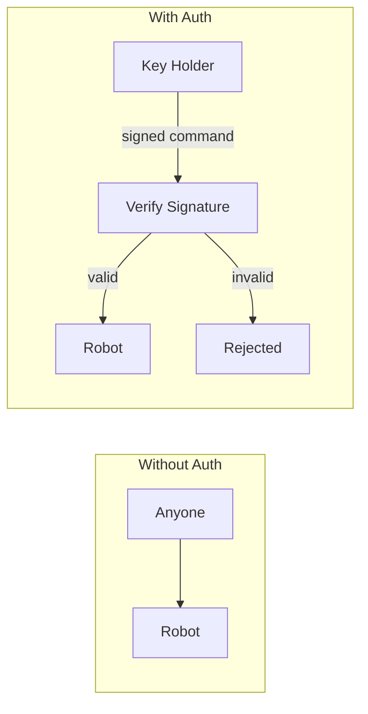
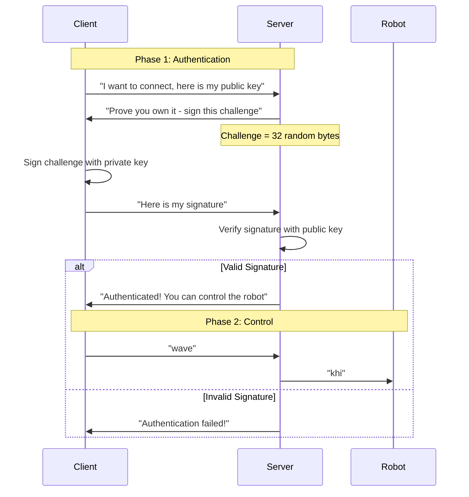
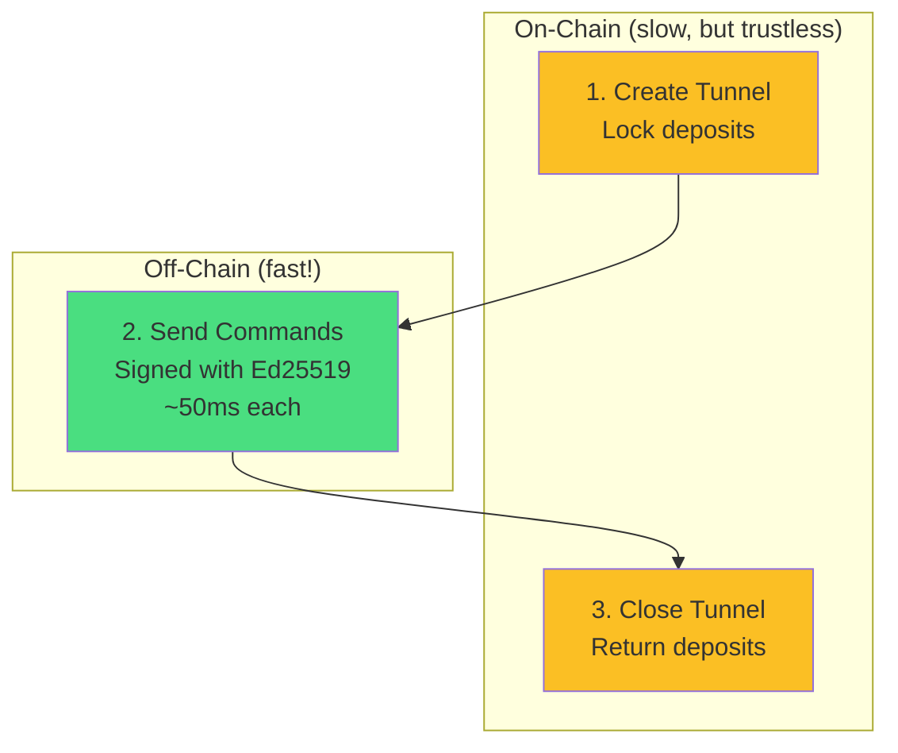
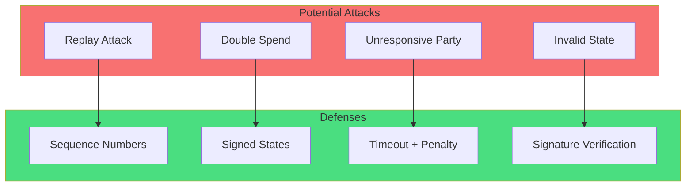
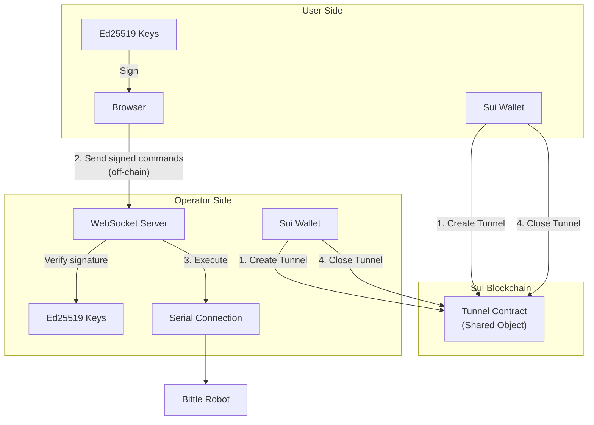

# Module 7: Secure the Channel - Authentication and On-Chain Tunnels

**The most important module for understanding blockchain + robots!**

This module teaches you how to secure robot control and introduces **on-chain tunnels** (state channels) - the key innovation that makes real-time blockchain robot control possible.

**Goal**: Understand authentication for robots and how on-chain tunnels enable fast, secure, trustless robot control.

**Time**: 2-3 hours

**Prerequisites**:

- Completed Modules 1-6
- Understanding of digital signatures (we will review!)
- Sui CLI installed (for Part B)

---

## Table of Contents

1. [Why Authentication Matters for Robots](#why-authentication-matters-for-robots)
2. [Part A: Off-Chain Authentication](#part-a-off-chain-authentication)
3. [Part B: On-Chain Tunnels](#part-b-on-chain-tunnels)
4. [Deep Dive: State Channels Explained](#deep-dive-state-channels-explained)
5. [The Complete Picture](#the-complete-picture)
6. [Exercises](#exercises)
7. [Resources](#resources)

---

## Why Authentication Matters for Robots

### The Problem: Open Robot Control

In Modules 5 and 6, we built a system where anyone with the URL can control your robot:

```
┌─────────────────────────────────────────────────────────────────────────────┐
│                    THE PROBLEM: NO AUTHENTICATION                           │
│                                                                             │
│   Tunnel URL: https://robot-xyz.trycloudflare.com                           │
│                                                                             │
│   ┌──────────┐                                                              │
│   │  You     │────► "wave" ────► Robot waves ✓                              │
│   └──────────┘                                                              │
│                                                                             │
│   ┌──────────┐                                                              │
│   │ Attacker │────► "walk off table" ────► Robot breaks! ✗                  │
│   └──────────┘                                                              │
│                                                                             │
│   ┌──────────┐                                                              │
│   │ Random   │────► "infinite loop" ────► Robot damaged! ✗                  │
│   │ Person   │                                                              │
│   └──────────┘                                                              │
│                                                                             │
│   Anyone with the URL can send any command!                                 │
└─────────────────────────────────────────────────────────────────────────────┘
```

### Why This Is Dangerous

```
┌─────────────────────────────────────────────────────────────────────────────┐
│                         ROBOT SECURITY RISKS                                │
│                                                                             │
│   Physical Safety:                                                          │
│   - Robot could walk off table, into water, hit people                      │
│   - Servos could burn out from abuse                                        │
│   - Battery could be drained                                                │
│                                                                             │
│   Financial:                                                                │
│   - Robot costs $300+                                                       │
│   - Repairs are expensive                                                   │
│   - Replacement parts hard to find                                          │
│                                                                             │
│   Privacy:                                                                  │
│   - Robot might have camera/microphone                                      │
│   - Could be used to spy on you                                             │
│                                                                             │
│   Accountability:                                                           │
│   - Who sent that command?                                                  │
│   - No audit trail                                                          │
│   - Cannot identify bad actors                                              │
└─────────────────────────────────────────────────────────────────────────────┘
```

### The Solution: Authentication

Authentication answers the question: **"Who is sending this command?"**



---

## Part A: Off-Chain Authentication

The simplest form of authentication: **Ed25519 Challenge-Response**

### How It Works



### Why Challenge-Response?

```
┌─────────────────────────────────────────────────────────────────────────────┐
│                    WHY CHALLENGE-RESPONSE?                                  │
│                                                                             │
│   Why not just send the private key?                                        │
│   ─────────────────────────────────                                         │
│   NEVER do this! Anyone who intercepts it can impersonate you.              │
│                                                                             │
│   Why not sign a fixed message?                                             │
│   ────────────────────────────                                              │
│   Replay attack! Attacker records signature, replays it later.              │
│                                                                             │
│   Why random challenge works:                                               │
│   ─────────────────────────                                                 │
│   1. Server generates NEW random challenge each time                        │
│   2. Client signs THIS SPECIFIC challenge                                   │
│   3. Signature only valid for THIS challenge                                │
│   4. Cannot be replayed (different challenge next time!)                    │
│                                                                             │
│   The math:                                                                 │
│   - Ed25519 signature = f(private_key, message)                             │
│   - Same message + same key = same signature (deterministic)                │
│   - Different message = completely different signature                      │
│   - Cannot create valid signature without private key                       │
└─────────────────────────────────────────────────────────────────────────────┘
```

### Quick Start: Part A

```bash
cd part-a-offchain

# 1. Install dependencies
pnpm install

# 2. Generate your key pair
pnpm generate-keys
# This creates .env with your keys

# 3. Run the demo (no server needed!)
pnpm demo

# 4. Start authenticated server
pnpm run server

# 5. In another terminal, connect as client
pnpm run client
# Type commands: wave, sit, stand, forward, etc.
```

### Code Walkthrough: Challenge-Response

**Server sends challenge:**

```typescript
// Generate 32 random bytes - impossible to predict!
const challenge = randomBytes(32);

// Send to client
send(ws, {
  type: "auth_challenge",
  challenge: challenge.toString("hex"),
});
```

**Client signs challenge:**

```typescript
import * as ed from "@noble/ed25519";

// Sign the challenge with private key
const signature = await ed.signAsync(challenge, privateKey);

// Send signature back (NOT the private key!)
send(ws, {
  type: "auth_response",
  signature: signature.toString("hex"),
});
```

**Server verifies:**

```typescript
// Verify signature using client's PUBLIC key
const valid = await ed.verifyAsync(signature, challenge, publicKey);

if (valid) {
  // Client proved they own the private key!
  state.authenticated = true;
}
```

---

## Part B: On-Chain Tunnels

**This is the key innovation for blockchain + robots!**

### The Problem with Blockchain Robot Control

```
┌─────────────────────────────────────────────────────────────────────────────┐
│                    BLOCKCHAIN IS SLOW!                                      │
│                                                                             │
│   Traditional blockchain approach:                                          │
│                                                                             │
│   User ──► Transaction ──► Blockchain ──► Robot                             │
│            (sign, submit)   (consensus)    (execute)                        │
│                  │              │              │                            │
│                  └──────────────┴──────────────┘                            │
│                        ~3-5 seconds per command                             │
│                                                                             │
│   Real-time control needs:                                                  │
│                        ~50 milliseconds per command                         │
│                                                                             │
│   That is 100x too slow!                                                    │
└─────────────────────────────────────────────────────────────────────────────┘
```

### The Solution: State Channels (Tunnels)

A **state channel** (we call it a "tunnel") is a way to:

1. Lock funds on-chain (once)
2. Transact off-chain (unlimited, instant)
3. Settle on-chain (once)



### How Tunnels Work: Step by Step

```
┌─────────────────────────────────────────────────────────────────────────────┐
│                         TUNNEL LIFECYCLE                                    │
│                                                                             │
│   STEP 1: CREATE TUNNEL (On-Chain Transaction)                              │
│   ─────────────────────────────────────────────                             │
│                                                                             │
│   User deposits 0.1 SUI ──────┐                                             │
│                               ├──► Tunnel Contract                          │
│   Operator deposits 0.1 SUI ──┘    (Shared Object)                          │
│                                         │                                   │
│   Both register Ed25519 public keys ────┘                                   │
│                                                                             │
│   Result: Tunnel is ACTIVE, funds are LOCKED                                │
│                                                                             │
│   ───────────────────────────────────────────────────────────────────────── │
│                                                                             │
│   STEP 2: USE TUNNEL (Off-Chain!)                                           │
│   ────────────────────────────────                                          │
│                                                                             │
│   User: "wave" ──► Sign with Ed25519 ──► Send to Operator                   │
│                                               │                             │
│   Operator: Verify signature ◄────────────────┘                             │
│             Execute command on robot                                        │
│                                                                             │
│   NO BLOCKCHAIN TRANSACTION! Instant execution!                             │
│                                                                             │
│   ───────────────────────────────────────────────────────────────────────── │
│                                                                             │
│   STEP 3: CLOSE TUNNEL (On-Chain Transaction)                               │
│   ───────────────────────────────────────────                               │
│                                                                             │
│   Both parties sign settlement:                                             │
│     "User gets 0.1 SUI, Operator gets 0.1 SUI"                              │
│                                                                             │
│   Submit to blockchain ──► Verify signatures ──► Return deposits            │
│                                                                             │
│   Tunnel destroyed, everyone happy!                                         │
│                                                                             │
└─────────────────────────────────────────────────────────────────────────────┘
```

### Why Deposits Matter

The deposits ensure **honest behavior**:

```
┌─────────────────────────────────────────────────────────────────────────────┐
│                         GAME THEORY OF TUNNELS                              │
│                                                                             │
│   Scenario 1: Everyone behaves honestly                                     │
│   ─────────────────────────────────────                                     │
│   - User sends valid commands                                               │
│   - Operator executes them                                                  │
│   - Both sign settlement                                                    │
│   - Both get deposits back ✓                                                │
│                                                                             │
│   Scenario 2: User tries to cheat                                           │
│   ─────────────────────────────────                                         │
│   - User sends command, operator executes                                   │
│   - User refuses to sign settlement                                         │
│   - Operator submits proof of misbehavior                                   │
│   - User LOSES penalty from deposit ✗                                       │
│                                                                             │
│   Scenario 3: Operator tries to cheat                                       │
│   ─────────────────────────────────────                                     │
│   - User sends valid command                                                │
│   - Operator does not execute it                                            │
│   - User submits proof of misbehavior                                       │
│   - Operator LOSES penalty from deposit ✗                                   │
│                                                                             │
│   Result: Cheating is economically irrational!                              │
│   Both parties are incentivized to behave honestly.                         │
│                                                                             │
└─────────────────────────────────────────────────────────────────────────────┘
```

### Quick Start: Part B

```bash
cd part-b-onchain

# 1. Build the Move contract
cd move
sui move build

# 2. Deploy to testnet
sui client publish --gas-budget 100000000

# 3. Copy the package ID to client/.env

# 4. Install client dependencies
cd ../client
pnpm install
cp .env.example .env
# Edit .env with your configuration

# 5. Run the demo (no deployment needed!)
pnpm demo

# 6. Create a real tunnel (needs deployment)
pnpm create-tunnel

# 7. Close the tunnel
pnpm close-tunnel
```

### The Move Contract: Key Parts

**Creating a Tunnel:**

```move
public struct Tunnel has key, store {
    id: UID,

    // Security deposits
    user_deposit: Balance<SUI>,
    operator_deposit: Balance<SUI>,

    // Ed25519 public keys for verification
    user_public_key: vector<u8>,
    operator_public_key: vector<u8>,

    // State tracking
    sequence_number: u64,
    is_active: bool,

    // Penalty for misbehavior
    penalty_amount: u64,
}
```

**Verifying Signatures:**

```move
public fun verify_signature(
    tunnel: &Tunnel,
    is_user: bool,
    signature: &vector<u8>,
    message: &vector<u8>,
): bool {
    let public_key = if (is_user) {
        &tunnel.user_public_key
    } else {
        &tunnel.operator_public_key
    };

    // Built-in Sui Move function!
    ed25519::ed25519_verify(signature, public_key, message)
}
```

**Closing Cooperatively:**

```move
public fun close_tunnel_cooperative(
    tunnel: Tunnel,
    user_final_balance: u64,
    operator_final_balance: u64,
    user_signature: vector<u8>,
    operator_signature: vector<u8>,
    ctx: &mut TxContext,
): (Coin<SUI>, Coin<SUI>) {
    // Build settlement message
    let settlement_msg = build_settlement_message(...);

    // BOTH parties must sign
    verify_signature_or_abort(&tunnel, true, &user_signature, &settlement_msg);
    verify_signature_or_abort(&tunnel, false, &operator_signature, &settlement_msg);

    // Return deposits according to agreement
    // ...
}
```

---

## Deep Dive: State Channels Explained

### What is a State Channel?

```
┌─────────────────────────────────────────────────────────────────────────────┐
│                    STATE CHANNEL CONCEPT                                    │
│                                                                             │
│   Think of it like a bar tab:                                               │
│                                                                             │
│   Traditional (blockchain):                                                 │
│   ────────────────────────                                                  │
│   - Order drink #1 → Pay → Wait for receipt                                 │
│   - Order drink #2 → Pay → Wait for receipt                                 │
│   - Order drink #3 → Pay → Wait for receipt                                 │
│   - Each drink takes 5 minutes to process!                                  │
│                                                                             │
│   State channel (tunnel):                                                   │
│   ────────────────────────                                                  │
│   - Open tab (deposit $50)                                                  │
│   - Order drink #1 → Instant!                                               │
│   - Order drink #2 → Instant!                                               │
│   - Order drink #3 → Instant!                                               │
│   - Close tab (settle up)                                                   │
│   - Only 2 transactions, unlimited drinks!                                  │
│                                                                             │
└─────────────────────────────────────────────────────────────────────────────┘
```

### State Channel vs. Traditional Transactions

| Aspect      | Traditional        | State Channel             |
| ----------- | ------------------ | ------------------------- |
| Speed       | 3-5 seconds        | 50 milliseconds           |
| Cost        | Gas per action     | Gas for open/close only   |
| Scalability | Limited by chain   | Unlimited off-chain       |
| Trust       | Trustless          | Trustless (with deposits) |
| Finality    | Immediate on-chain | Delayed until close       |

### When to Use State Channels

```
┌─────────────────────────────────────────────────────────────────────────────┐
│                    WHEN TO USE STATE CHANNELS                               │
│                                                                             │
│   GOOD USE CASES:                                                           │
│   ────────────────                                                          │
│   ✓ Real-time robot control (this module!)                                  │
│   ✓ Gaming (many rapid transactions)                                        │
│   ✓ Micropayments (streaming payments)                                      │
│   ✓ Two-party interactions                                                  │
│                                                                             │
│   BAD USE CASES:                                                            │
│   ───────────────                                                           │
│   ✗ Many participants (channels are 2-party)                                │
│   ✗ Need immediate finality                                                 │
│   ✗ Infrequent transactions                                                 │
│   ✗ Public auditability required                                            │
│                                                                             │
└─────────────────────────────────────────────────────────────────────────────┘
```

### Security Model



---

## The Complete Picture

### Full System Architecture



### Data Flow: Complete Journey

```
┌─────────────────────────────────────────────────────────────────────────────┐
│                    COMPLETE DATA FLOW                                       │
│                                                                             │
│   SETUP PHASE (once):                                                       │
│   ───────────────────                                                       │
│                                                                             │
│   1. User creates Sui wallet                                                │
│   2. Operator creates Sui wallet                                            │
│   3. Both generate Ed25519 keys                                             │
│   4. Create tunnel on-chain (deposits locked)                               │
│   5. Exchange public keys                                                   │
│                                                                             │
│   RUNTIME PHASE (repeated):                                                 │
│   ─────────────────────────                                                 │
│                                                                             │
│   For each command:                                                         │
│   6. User builds command message: tunnel_id + sequence + command            │
│   7. User signs with Ed25519 private key                                    │
│   8. User sends to operator via WebSocket                                   │
│   9. Operator verifies Ed25519 signature                                    │
│   10. Operator sends serial command to robot                                │
│   11. Robot executes                                                        │
│   12. Increment sequence number                                             │
│                                                                             │
│   Steps 6-12 take ~50ms total! No blockchain!                               │
│                                                                             │
│   TEARDOWN PHASE (once):                                                    │
│   ────────────────────────                                                  │
│                                                                             │
│   13. Both parties agree on final state                                     │
│   14. Both sign settlement                                                  │
│   15. Submit close transaction                                              │
│   16. Deposits returned                                                     │
│                                                                             │
└─────────────────────────────────────────────────────────────────────────────┘
```

### Comparison: Part A vs Part B

| Aspect         | Part A (Off-Chain)   | Part B (On-Chain)    |
| -------------- | -------------------- | -------------------- |
| Trust model    | Trust the server     | Trustless (deposits) |
| Key management | Self-managed         | Wallet + Ed25519     |
| Cost           | Free                 | Gas for open/close   |
| Audit trail    | Server logs          | Blockchain           |
| Recovery       | None                 | Dispute resolution   |
| Complexity     | Simple               | More complex         |
| Use case       | Trusted environments | Public/untrusted     |

---

## Project Structure

```
Module7/
├── README.md                      # This file
├── part-a-offchain/               # Simple auth (no blockchain)
│   ├── package.json
│   ├── tsconfig.json
│   ├── public/
│   │   └── index.html             # Browser-based auth
│   └── src/
│       ├── generate-keys.ts       # Create Ed25519 keys
│       ├── server.ts              # Authenticated server
│       ├── client.ts              # CLI client
│       └── demo.ts                # Standalone demo
└── part-b-onchain/                # Blockchain tunnels
    ├── move/                      # Sui Move contract
    │   ├── Move.toml
    │   └── sources/
    │       └── robot_tunnel.move  # Tunnel contract
    └── client/                    # TypeScript client
        ├── package.json
        ├── tsconfig.json
        ├── .env.example
        └── src/
            ├── config.ts          # Configuration
            ├── create-tunnel.ts   # Create tunnel
            ├── close-tunnel.ts    # Close tunnel
            └── demo.ts            # Standalone demo
```

---

## Exercises

### Exercise 1: Add Command Signing to Part A

Modify the Part A server to require signature on EVERY command, not just authentication:

```typescript
// Client signs each command
const commandMsg = `${tunnelId}:${sequenceNumber}:${command}`;
const signature = await ed.signAsync(commandMsg, privateKey);

ws.send({
  type: "command",
  command: command,
  sequence: sequenceNumber,
  signature: signature.toString("hex"),
});
```

### Exercise 2: Implement Timeout Dispute

Add a timeout mechanism to the Move contract:

```move
public struct Tunnel has key, store {
    // ... existing fields ...
    last_activity: u64,  // Timestamp of last activity
    timeout_duration: u64,  // How long before timeout
}

public fun claim_timeout_penalty(
    tunnel: &mut Tunnel,
    clock: &Clock,
    ctx: &mut TxContext,
): Coin<SUI> {
    let current_time = clock::timestamp_ms(clock);
    assert!(current_time > tunnel.last_activity + tunnel.timeout_duration, ENotTimedOut);
    // ... claim penalty ...
}
```

### Exercise 3: Multi-Command Batch

Send multiple commands with a single signature:

```typescript
const commands = ["wave", "sit", "stand"];
const batchMessage = commands.join(",");
const signature = await ed.signAsync(batchMessage, privateKey);

// Server executes all commands in sequence
```

### Exercise 4: Add Rate Limiting

Prevent abuse by limiting commands per time period:

```typescript
const commandHistory = new Map<string, number[]>();

function checkRateLimit(publicKey: string): boolean {
  const history = commandHistory.get(publicKey) || [];
  const recentCommands = history.filter((t) => Date.now() - t < 60000);

  if (recentCommands.length >= 10) {
    return false; // Too many commands!
  }

  recentCommands.push(Date.now());
  commandHistory.set(publicKey, recentCommands);
  return true;
}
```

---

## Key Takeaways

1. **Authentication is essential** for robot control - never expose robots without it
2. **Challenge-response** proves identity without exposing private keys
3. **On-chain tunnels** enable real-time blockchain robot control
4. **Deposits create incentives** for honest behavior
5. **Off-chain execution** is fast, on-chain settlement is secure
6. **State channels are perfect** for frequent two-party interactions

---

## What is Next?

Now that you understand secure channels, you are ready for:

- **Module 8**: Tokenomics - Add payment flows to tunnels
- **Module 9**: Multi-robot - Coordinate multiple robots
- **Module 10**: Full platform - Production-ready system

---

## Resources

- [Ed25519 Algorithm](https://ed25519.cr.yp.to/)
- [State Channels Overview](https://ethereum.org/en/developers/docs/scaling/state-channels/)
- [Sui Move Documentation](https://docs.sui.io/build/move)
- [Sui Ed25519 in Move](https://docs.sui.io/references/framework/sui-framework/ed25519)
- [noble-ed25519 Library](https://github.com/paulmillr/noble-ed25519)
- [Part A: Off-Chain Auth](./part-a-offchain/)
- [Part B: On-Chain Tunnels](./part-b-onchain/)
- [Module 5: WebSocket + Serial](../Module5%20-%20WebSocket%20+%20Serial/README.md)
- [Module 6: Tunneling](../Module6/README.md)
