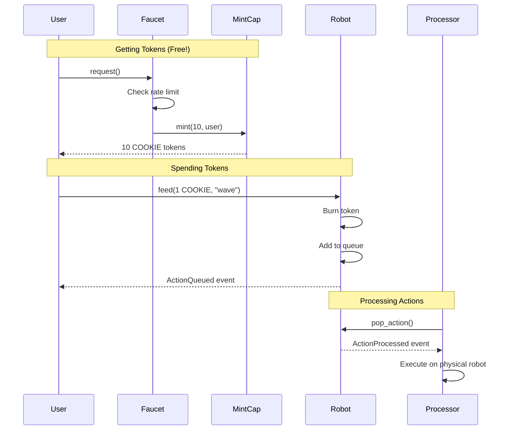

# Module R8: Pay to Play - Tokenomics

Create an economic model for shared robot access using custom tokens on Sui.

**Goal**: Learn how to create tokens, rate-limited faucets, and pay-per-action systems on Sui.

**Time**: 3-4 hours

**Prerequisites**:

- Completed Module 2 (Blockchain Fundamentals)
- Sui CLI installed and configured
- A wallet with testnet SUI

---

## What You Will Learn

1. Creating custom tokens with the Sui Coin module
2. The One-Time Witness (OTW) pattern
3. TreasuryCap and controlled minting
4. Rate limiting with Clock and Tables
5. Receiving and burning tokens in transactions
6. Events for off-chain tracking

---

## System Architecture

```
┌─────────────────────────────────────────────────────────────────────────────┐
│                           TOKENOMICS ARCHITECTURE                           │
│                                                                             │
│                        ┌─────────────────────────┐                          │
│                        │      COOKIE Token       │                          │
│                        │  ┌─────────────────┐    │                          │
│                        │  │   TreasuryCap   │    │                          │
│                        │  │  (mint control) │    │                          │
│                        │  └────────┬────────┘    │                          │
│                        │           │             │                          │
│                        │  ┌────────▼────────┐    │                          │
│                        │  │    MintCap      │    │                          │
│                        │  │ (shared object) │    │                          │
│                        │  │ max_supply:10000│    │                          │
│                        │  └────────┬────────┘    │                          │
│                        └───────────┼─────────────┘                          │
│                                    │                                        │
│              ┌─────────────────────┼─────────────────────┐                  │
│              │                     │                     │                  │
│              ▼                     ▼                     ▼                  │
│   ┌─────────────────┐   ┌─────────────────┐   ┌─────────────────┐           │
│   │     Faucet      │   │    Robot Pet    │   │   User Wallet   │           │
│   │                 │   │                 │   │                 │           │
│   │ rate limiting:  │   │ 1 COOKIE =      │   │ holds COOKIE    │           │
│   │ 100/day/address │   │ 1 queued action │   │ tokens          │           │
│   │                 │   │                 │   │                 │           │
│   │ ┌─────────────┐ │   │ ┌─────────────┐ │   │                 │           │
│   │ │FaucetManager│ │   │ │ActionQueue  │ │   │                 │           │
│   │ │ records per │ │   │ │ FIFO order  │ │   │                 │           │
│   │ │ user        │ │   │ └─────────────┘ │   │                 │           │
│   │ └─────────────┘ │   │                 │   │                 │           │
│   └────────┬────────┘   └────────┬────────┘   └────────┬────────┘           │
│            │                     │                     │                    │
│            └──────────┬──────────┴──────────┬──────────┘                    │
│                       │                     │                               │
│                       ▼                     ▼                               │
│              ┌─────────────────┐   ┌─────────────────┐                      │
│              │  User requests  │   │   User feeds    │                      │
│              │  free tokens    │   │   robot with    │                      │
│              │  (10 per call)  │   │   1 COOKIE      │                      │
│              └─────────────────┘   └─────────────────┘                      │
│                                                                             │
└─────────────────────────────────────────────────────────────────────────────┘
```

---

## Token Flow



---

## Quick Start

### Step 1: Build and Deploy

```bash
# Build the contracts
cd move
sui move build

# Deploy to testnet
sui client publish --gas-budget 100000000
```

You will see output like:

```
╭─────────────────────────────────────────────────────────────────────────╮
│ Object Changes                                                          │
├─────────────────────────────────────────────────────────────────────────┤
│ Created Objects:                                                        │
│  ┌──                                                                    │
│  │ ObjectID: 0xabc123...  (MintCap - shared)                            │
│  │ ObjectID: 0xdef456...  (FaucetManager - shared)                      │
│  │ ObjectID: 0x789...     (CoinMetadata - frozen)                       │
│  └──                                                                    │
│                                                                         │
│ Published Package:                                                      │
│  PackageID: 0x1234567890abcdef...                                       │
╰─────────────────────────────────────────────────────────────────────────╯
```

### Step 2: Configure the Client

```bash
cd ../client
cp .env.example .env
```

Edit `.env` with your values:

```env
NETWORK=testnet
PACKAGE_ADDRESS=0x1234567890abcdef...
MINT_CAP_ID=0xabc123...
FAUCET_MANAGER_ID=0xdef456...
USER_PHRASE="your twelve word mnemonic phrase here"
```

### Step 3: Create a Robot

```bash
pnpm install
pnpm create-robot "MyRobot"
```

Copy the `ROBOT_ID` to your `.env`.

### Step 4: Run the Demo

```bash
pnpm demo
```

---

## Understanding the Contracts

### 1. COOKIE Token (`cookie.move`)

The COOKIE token is the currency of our robot economy.

#### One-Time Witness Pattern

```move
/// The One-Time Witness - can only be created once!
public struct COOKIE has drop {}

fun init(otw: COOKIE, ctx: &mut TxContext) {
    // otw proves this is the real initialization
    let (treasury_cap, metadata) = coin::create_currency(
        otw,           // Consumed here, can never be created again
        0,             // 0 decimals (whole tokens only)
        b"COOKIE",     // Symbol
        b"Robot Cookie",
        b"Tokens for feeding robots",
        option::none(),
        ctx,
    );
    // ...
}
```

**Why OTW?** It guarantees:

- Only ONE COOKIE token type can ever exist
- Nobody can create a fake COOKIE token
- The token is created by the package itself, not an external actor

#### MintCap: Controlled Minting

```move
public struct MintCap has key {
    id: UID,
    treasury_cap: TreasuryCap<COOKIE>,  // The actual minting capability
    max_supply: u64,                     // Hard cap on total supply
}
```

We wrap `TreasuryCap` in `MintCap` to:

1. Add a maximum supply limit
2. Share it globally (so anyone can use the faucet)
3. Still control minting through our functions

#### Visibility: `public(package)`

```move
/// Only modules in THIS package can call this function
public(package) fun mint(
    mint_cap: &mut MintCap,
    amount: u64,
    recipient: address,
    ctx: &mut TxContext,
) {
    // ...
}
```

This prevents external contracts from minting tokens directly.

---

### 2. Faucet (`faucet.move`)

A rate-limited token dispenser.

#### Using the Clock

```move
use sui::clock::Clock;

public fun request(
    faucet: &mut FaucetManager,
    mint_cap: &mut MintCap,
    clock: &Clock,  // Always at address 0x6
    ctx: &mut TxContext,
) {
    let current_time = clock.timestamp_ms();
    // Use time for rate limiting...
}
```

The Clock is a **system object** that:

- Always exists at address `0x6`
- Provides current time in milliseconds
- Is immutable (read-only)

#### Table Storage for Per-User Tracking

```move
use sui::table::{Self, Table};

public struct FaucetManager has key {
    id: UID,
    records: Table<address, MintRecord>,  // Key-value storage
    total_distributed: u64,
}
```

Tables are perfect for tracking per-user data:

- O(1) lookup by key
- Can grow to any size
- Only loads accessed entries (efficient)

#### Rate Limiting Logic

```
┌─────────────────────────────────────────────────────────────────────────────┐
│                         RATE LIMITING FLOW                                  │
│                                                                             │
│   User requests tokens                                                      │
│         │                                                                   │
│         ▼                                                                   │
│   ┌───────────────────┐                                                     │
│   │ Has existing      │──No──► Create new record                            │
│   │ MintRecord?       │        amount_today = requested                     │
│   └─────────┬─────────┘        last_request = now                           │
│             │                                                               │
│            Yes                                                              │
│             │                                                               │
│             ▼                                                               │
│   ┌───────────────────┐                                                     │
│   │ 24 hours since    │──Yes──► Reset amount_today to 0                     │
│   │ last request?     │                                                     │
│   └─────────┬─────────┘                                                     │
│             │                                                               │
│            No                                                               │
│             │                                                               │
│             ▼                                                               │
│   ┌───────────────────┐                                                     │
│   │ remaining =       │                                                     │
│   │ 100 - amount_today│                                                     │
│   └─────────┬─────────┘                                                     │
│             │                                                               │
│             ▼                                                               │
│   ┌───────────────────┐                                                     │
│   │ Mint min(requested│                                                     │
│   │ remaining)        │                                                     │
│   └───────────────────┘                                                     │
│                                                                             │
└─────────────────────────────────────────────────────────────────────────────┘
```

---

### 3. Robot Pet (`robot_pet.move`)

The pay-per-action queue.

#### Receiving Coin Payment

```move
public fun feed(
    robot: &mut RobotPet,
    mint_cap: &mut MintCap,
    payment: Coin<COOKIE>,  // User sends a Coin object
    action_name: String,
    clock: &Clock,
    ctx: &mut TxContext,
) {
    // Verify payment amount
    assert!(payment.value() >= ACTION_COST, EInsufficientPayment);

    // Burn the token via TreasuryCap (properly reduces total supply)
    cookie::burn(mint_cap, payment);

    // Queue the action...
}
```

**Coin vs Balance**:

- `Coin<T>`: An object with an ID, can be transferred
- `Balance<T>`: Raw amount, no ID, used inside objects

When a user pays:

1. They own a `Coin<COOKIE>` object
2. They send it in the transaction
3. We receive it and destroy/transfer it
4. The tokens are removed from circulation

#### Events for Off-Chain Systems

```move
public struct ActionQueued has copy, drop {
    robot_id: ID,
    action_name: String,
    sender: address,
    queue_position: u64,
    timestamp: u64,
}

// Inside feed():
event::emit(ActionQueued {
    robot_id: object::id(robot),
    action_name,
    sender: ctx.sender(),
    queue_position,
    timestamp: clock.timestamp_ms(),
});
```

Events are:

- **Not stored on-chain** (saves gas)
- **Recorded in transaction logs** (queryable)
- **Perfect for** UI updates, processor triggers, analytics

#### FIFO Queue

```move
public struct RobotPet has key {
    // ...
    action_queue: vector<QueuedAction>,  // First in, first out
}

// Add to end
robot.action_queue.push_back(action);

// Remove from front
let action = robot.action_queue.remove(0);
```

---

## TypeScript Client Usage

### Request Tokens

```typescript
import { Transaction } from "@mysten/sui/transactions";

const tx = new Transaction();

tx.moveCall({
  target: `${PACKAGE_ID}::faucet::request`,
  arguments: [
    tx.object(FAUCET_MANAGER_ID),
    tx.object(MINT_CAP_ID),
    tx.object(SUI_CLOCK_OBJECT_ID), // Clock is always at 0x6
  ],
});

await client.signAndExecuteTransaction({
  transaction: tx,
  signer: keypair,
});
```

### Feed the Robot

```typescript
// First, get a COOKIE coin to pay with
const coins = await client.getCoins({
  owner: address,
  coinType: `${PACKAGE_ID}::cookie::COOKIE`,
});

const tx = new Transaction();

// Split exactly 1 COOKIE from an existing coin
const [payment] = tx.splitCoins(tx.object(coins.data[0].coinObjectId), [
  tx.pure.u64(1),
]);

tx.moveCall({
  target: `${PACKAGE_ID}::robot_pet::feed`,
  arguments: [
    tx.object(ROBOT_ID),
    payment, // The split coin
    tx.pure.string("wave"),
    tx.object(SUI_CLOCK_OBJECT_ID),
  ],
});
```

### Listen for Events

```typescript
// Subscribe to events
const unsubscribe = await client.subscribeEvent({
  filter: {
    MoveEventType: `${PACKAGE_ID}::robot_pet::ActionQueued`,
  },
  onMessage: (event) => {
    console.log("Action queued:", event.parsedJson);
    // Update UI, trigger processor, etc.
  },
});
```

---

## Project Structure

```
R8/
├── README.md                 # This file
├── move/
│   ├── Move.toml             # Package configuration
│   └── sources/
│       ├── cookie.move       # COOKIE token contract
│       ├── faucet.move       # Rate-limited faucet
│       └── robot_pet.move    # Pay-per-action queue
└── client/
    ├── package.json
    ├── tsconfig.json
    ├── .env.example
    └── src/
        ├── config.ts          # Sui client setup
        ├── request-cookies.ts # Get tokens from faucet
        ├── check-balance.ts   # View balance and stats
        ├── create-robot.ts    # Create a RobotPet
        ├── feed-robot.ts      # Queue an action
        ├── read-queue.ts      # View the queue
        ├── pop-action.ts      # Process actions (admin)
        └── demo.ts            # Complete workflow
```

---

## Key Concepts Summary

### 1. One-Time Witness (OTW)

```move
public struct TOKEN has drop {}  // Name = MODULE_NAME in UPPERCASE
```

- Created automatically by Sui during `init`
- Can only exist once, ever
- Proves authenticity of token creation

### 2. TreasuryCap

```move
let (treasury_cap, metadata) = coin::create_currency(otw, ...);
```

- Controls minting of a token type
- Whoever holds it can mint tokens
- Usually wrapped or shared with restrictions

### 3. Shared Objects

```move
transfer::share_object(my_object);
```

- Anyone can read/modify (through functions)
- Enables multi-user access
- Requires consensus (slightly slower)

### 4. Tables

```move
let records: Table<address, MintRecord> = table::new(ctx);
records.add(key, value);
let entry = records.borrow(key);
```

- Key-value storage
- Efficient for per-user data
- Only loads accessed entries

### 5. Clock Object

```move
use sui::clock::Clock;
let time = clock.timestamp_ms();  // Milliseconds since epoch
```

- System object at `0x6`
- Provides current time
- Essential for time-based logic

### 6. Events

```move
event::emit(MyEvent { ... });
```

- Not stored on-chain
- Queryable from transaction logs
- Perfect for off-chain coordination

---

## Exercises

### Exercise 1: Variable Faucet Amount

Modify the faucet to accept a custom amount:

```move
public fun request_amount(
    faucet: &mut FaucetManager,
    mint_cap: &mut MintCap,
    amount: u64,  // User specifies amount
    clock: &Clock,
    ctx: &mut TxContext,
)
```

### Exercise 2: Action Costs

Make different actions cost different amounts:

```move
// In robot_pet.move
fun get_action_cost(action: &String): u64 {
    if (*action == b"wave".to_string()) { 1 }
    else if (*action == b"jump".to_string()) { 2 }
    else if (*action == b"dance".to_string()) { 5 }
    else { 1 }
}
```

### Exercise 3: Refund Mechanism

Add a function to refund tokens if an action cannot be executed:

```move
public fun refund_action(
    robot: &mut RobotPet,
    mint_cap: &mut MintCap,
    action_index: u64,
    ctx: &mut TxContext,
)
```

### Exercise 4: Token Burn Tracking

Track how many tokens have been burned:

```move
public struct RobotPet has key {
    // Add:
    total_tokens_burned: u64,
}
```

---

## Common Errors

### "ESupplyExceeded"

The maximum supply (10,000) has been reached. No more tokens can be minted.

### "EDailyLimitExceeded"

You have hit your daily limit (100 COOKIE). Wait 24 hours or use a different address.

### "EInsufficientPayment"

The payment coin does not have enough balance. You need at least 1 COOKIE.

### "EQueueEmpty"

Tried to pop from an empty queue. Check queue length first.

### "ENotAdmin"

Only the robot creator can pop actions. Use the correct wallet.

---

## Next Steps

Now that you understand tokenomics, you are ready for:

- **Module 9**: Add multi-user fairness and queue limits
- **Module 10**: Build the complete rental platform with billing

---

## Resources

- [Sui Coin Documentation](https://docs.sui.io/concepts/sui-move-concepts/packages/coin)
- [Sui Clock Documentation](https://docs.sui.io/concepts/sui-move-concepts/clock)
- [Sui Events](https://docs.sui.io/concepts/sui-move-concepts/events)
- [Module 2: Blockchain Fundamentals](../Module2%20-%20Blockchain%20Fundamentals/README.md)
